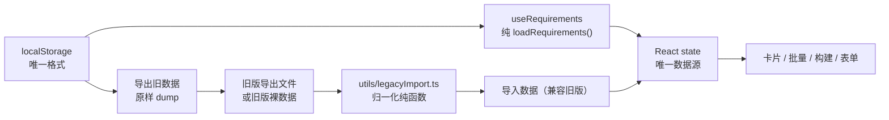

## 需求概述

对 work-tracker（工作记录系统）做一次「修 Bug + 清理历史兼容逻辑」的整治，最终交付一套干净、单一数据来源的实现。

## 核心功能

### 1. 修复：编辑需求时 items 丢失

现状：编辑需求时新增一个项目分支并保存，再次打开编辑，只见一条空分支（原登记的分支被覆盖）。
修复后：编辑对话框每次打开都准确回显当前需求的全部分支条目；新增/删除/修改条目按「数组增删改查」的方式工作，不再出现空行或数据丢失。

### 2. 修复：提交 MR 只打开一个标签页

现状：点「批量提交MR」/卡片「提交MR」时，只打开一个标签页，却提示"已打开 N 个"。
修复后：能在一次点击内打开多个 MR 标签页；被浏览器拦截时如实告知成功数与失败数，并引导用户从 MR 清单逐条手动打开。

### 3. 表单必填与 MR 多开确认

- 项目、分支均为必填，缺失时高亮对应行并阻止保存；空行在提交时被剥离。
- 单次待打开 MR 超过 10 个时，先弹窗确认，确认后再打开。

### 4. 数据来源单点化（清理历史兼容逻辑）

- 运行时不再有任何「猜旧格式 / 一次性迁移」逻辑：需求数据在内存与本地存储里只存在一种格式。
- 旧版数据只从「导入数据（兼容旧版）」这一个入口进入，导入时自动转换为新格式；导入入口同时兼容新格式、旧版本导出文件、以及旧版本导出的裸数据。
- 新增「导出旧数据」按钮：原样导出浏览器中现存的原始需求数据（不做任何转换），供旧版本环境逃生/搬运。闭环为：旧版数据 →「导出旧数据」→「导入数据（兼容旧版）」→ 得到新格式数据后可正常使用。
- 若检测到浏览器中现存的是旧版数据，页面顶部给出一次可关闭的提示，指引用户按上述闭环处理（仅提示，不自动改数据）。

## 视觉与交互

- 需求列表页工具栏按钮位置与风格保持不变，仅「导入数据」文案调整为「导入数据（兼容旧版）」，并在其后新增「导出旧数据」按钮；沿用现有黑白主色调与 Ant Design 组件风格。
- 编辑对话框的项目/分支区改为普通竖向列表，每行「项目下拉 + 分支输入 + 删除图标」，校验失败时该行控件呈红色错误态并在行下给出提示。
- 旧数据提示条为页面顶部一条可关闭的浅色告警条，不遮挡列表内容。

## 技术栈选择

复用现有技术栈，**不引入任何新依赖**：

| 项 | 选型 | 说明 |
| --- | --- | --- |
| 框架 | React 18 + TypeScript | 现有 |
| 构建 | Vite 5 | 现有 |
| UI | Ant Design 5（`@ant-design/icons`） | 现有 `Alert` / `Modal.confirm` / `Select.status` 足够覆盖新增需求 |
| 日期 | dayjs | 现有，表单发版日期继续使用 |
| 存储 | localStorage（`src/storage.ts`） | 现有，不新增存储键 |


## 实施方案

整体分三条独立主线，互相之间只有「类型契约」这一处耦合，可按序推进：

### A. 表单 items 受控重构（根因治理）

**问题本质**：`items` 同时存在两份状态 —— React state（`requirements`，数据源）与 antd `Form.List` 内部 store（副本）。`initialValues` 只在挂载时生效，`preserve={false}` 又使更新后的 `initialValues` 对 `Form.List` 失效；标量字段却能被 antd 受控回填，于是出现「表头正常、items 只剩一条空分支」。同时 `handleOk` 未过滤空行、`items[].project` 无必填规则，脏行得以落库。

**技术决策**：把 `items` 从 antd Form 的托管中**整体移出**，改由本地 `useState` 独占；antd Form 只托管 5 个标量字段（`name` / `tapdUrl` / `releaseDate` / `version` / `remark`）。

- 理由：`items` 本身就是一棵三级数组，业务语义是纯 CRUD，不需要表单库介入。移除 `Form.List` / `initialValues` 回填 / `preserve` / `Form.ErrorList` 这一整套「数组托管」机制后，"两份状态不同步"这一整类问题从根上消失（这也正是用户判断的"不该这么复杂"）。
- 数据流变为单向：`editing`（props）→ `useEffect` 初始化本地 state → 本地 CRUD → 提交时整组交回 `onSubmit` → `upsert` 落库。
- 代价：需自行实现行级必填校验（约 15 行）；失去 `validateFields` 对数组行的自动滚屏定位，改为就地错误态高亮，对少量行数而言体验更好。

**校验策略**：`handleOk` 内先 `form.validateFields()` 校验标量（antd 负责滚屏与红字），再本地校验 `items`：

1. 先剥离「项目与分支都为空」的整行（用户点了「添加」但没填）；
2. 剥离后为空 → 提示「请至少添加一个项目分支」并阻止提交；
3. 逐行要求 `project` 与 `branch` 均非空，把不合格行的 `key` 收进 `invalidKeys`，对应控件传 `status="error"`，列表下方给汇总提示。

### B. MR 多开可靠化

**问题本质**：`openInNewTab` 用动态 `<a target="_blank">` + 同步 `a.click()`，且在 `click()` 之后**同步 `remove()`**。两个隐患：其一，`display:none` 且点击后立刻从 DOM 移除，部分内核会中止导航；其二，函数无返回值，调用方无法感知失败，只能无条件 `message.success`。

**技术决策**（三层，逐级兜底）：

1. **首选 `window.open(url, '_blank')`**，用返回句柄是否为 `null` 判断是否被拦截；句柄非空时手动 `w.opener = null` 断开引用（经典 noopener polyfill）。

- **关键约束**：`window.open(url, '_blank', 'noopener')` 或带 `noopener`/`noreferrer` feature 时 Chrome **恒定返回 `null`**，会导致误判为「全部被拦截」。因此禁用 feature 参数写法。

2. **次选 `<a>` 兜底**：`window.open` 返回 `null` 时，创建 `<a target="_blank" rel="noreferrer">`，用 `opacity: 0` + 定尺寸定位**代替 `display: none`**（不可见元素在部分内核不视为用户导航），追加到 body 后 `click()`，并在 **下一个宏任务**（`setTimeout(..., 0)`）再 `remove()`，避免导航被中止。
3. **如实反馈 + 手动兜底通道**：`openManyTabs(urls)` 统计 `opened` / `failed`。全部成功 → `已打开 N 个 MR 页面`；存在失败 → `已打开 N 个，M 个被浏览器拦截，请从下方 MR 清单逐条打开`（`BatchPanel` 现成的 `<a href target="_blank">` 清单即为兜底通道，无需新增 UI）。

**阈值确认**：待打开数大于 10 时，先 `Modal.confirm` 二次确认；确认按钮的点击本身即为一次新的用户手势，循环在其同步回调内执行。

**统一入口**：卡片「提交MR」（`handleTrackMr`）与面板「批量提交MR」（`handleBatchMr`）共用同一套 `openManyTabs` + 反馈逻辑，消除两条链路行为不一致。

### C. 旧数据兼容逻辑清理 + 数据来源单点化

**技术决策**：确立「运行时零兼容」原则 —— 内存与 localStorage 中只存在唯一格式；**全部格式识别与转换集中在导入边界**（`src/utils/legacyImport.ts`），且为纯函数、不参与渲染。

迁移能力（原 `backfillRequirement` + `LEGACY_STATUS_TO_ENV`）**不删除，而是整体搬到导入边界**，仅被导入流程调用。



**唯一格式的关键约定**：`envWeizan` / `envStar` 保留三态语义并抽为具名类型 —— `undefined` = 该轨已被用户手动移除，`null` = 参与但未开始，环境值 = 已推进到该环境。卡片上「X 移除该轨 / + xx轨 恢复」交互**完整保留**。清理掉迁移逻辑后，`undefined` 的第二重含义（旧数据未迁移）自然消失，语义反而变纯净。

**必须记入实现的坑（会导致静默错误）**：`JSON.stringify` 会丢弃值为 `undefined` 的键，因此「已移除轨」在存储/导出后表现为**键缺失**，与「旧格式数据无此键」不可区分。结论：**旧数据检测不得使用「`envWeizan` 键是否存在」来判定**，必须改用旧格式特征字段（`currentEnv` / `buildEnv` / `versionPipeline` / `status` 之一存在）判定；导入归一化同理，仅当记录含旧格式特征字段时才走历史拆轨逻辑，否则缺键一律视为「该轨已移除」。

**导出契约**：常规「导出数据」升级为 `version: 2`；新增「导出旧数据」产出 `{ version: 'legacy-raw', exportedAt, raw: localStorage 原始字符串 }`（无损保留原字符串，即使内容已损坏也可取回）。

**导入契约**（同一入口识别四种输入）：朴素数组、`version: 1` 旧导出、`version: 2` 新导出、`version: 'legacy-raw'`（解开 `raw` 后递归走同一管线）。归一化后仍按新增/去重合并（现有 `merge` 语义不变）。

### D. 附带清理（死代码与过期注释）

| 位置 | 处置 |
| --- | --- |
| `hooks/useWorkTracker.ts` | 删 `migrateToDualTrackOnce`、`stripLegacyTrackTargetsOnce` 及两个标记键；`useRequirements` 初始化简化为 `loadRequirements()`；`upsert` 去掉 `buildItems` 透传（连带 `existing` 变量可简化） |
| `storage.ts` | 删 `migrateLegacyBuildPlan`、`migrateDevopsAppsExcludeFlag` 及相关旧键常量 |
| `config/track.ts` | 删 `backfillRequirement`、`LEGACY_STATUS_TO_ENV`（能力移交 `legacyImport.ts`），文件回归纯派生函数 |
| `types.ts` | 删 `status?`、`buildItems?`；`version` 改必填；`envWeizan/envStar` 改必填键 + `TrackEnvState` |
| `export.ts` | 导入解析整体移交 `legacyImport.ts`；`isValidRequirement` 收窄为只认新格式 |
| `pages/QuickBuildPage.tsx` | 删 `loadState` 中「旧扁平 `projects` 列表迁移为批次」分支 |
| `pages/RequirementListPage.tsx` | 删第 119 行「老数据已一次性静默迁移」过期注释 |


## 实施要点（执行细节）

- **类型契约先行**：`TrackEnvState` 与 `RequirementInput`（由 `RequirementFormValues` 上移到 `types.ts`，消除「hook 反向依赖组件类型」的分层瑕疵）先落地，其余改动由 `tsc --noEmit` 驱动定位所有调用点，避免漏改。
- **必填键的语义**：把 `envWeizan` 声明为必填键（类型为 `TrackEnvState`）而非可选键，使「漏写字段」成为编译期错误，而不是被静默解释成「该轨已移除」；对象字面量构造处需显式写出。
- **性能**：本次改动无新增遍历与请求。`items` 由 `useState` 托管后，单行编辑只触发本组件重渲染；此前 `Form.List` 的 store 同步开销一并消失。`openManyTabs` 为 O(n) 且 n 为用户可见的少量链接。
- **可靠性**：`legacyImport` 全部函数为纯函数、无副作用，便于单点验证；解析任何异常一律转换为「格式不正确」提示，不抛到渲染层。`loadRequirements` 保持 `try/catch → []` 兜底，运行时不做格式校验（与「零兼容」原则一致）。
- **影响面控制**：不改动 `batch.ts`、`RequirementCard`、`BuildPanel`、`ArtifactList`、`useBuildTasks` 的对外行为；不改动任何 localStorage 键名；不改动构建/制品的请求链路。
- **日志与提示**：沿用 antd `message` / `notification` 现有分级；新增提示不含敏感信息；旧数据提示条为一次性可关闭，不重复打扰。
- **无障碍与测试属性**：沿用项目既有约定，为新增可交互控件补 `data-testid`（如导入/导出按钮、表单条目行），格式 `{模块}-{语义}-{类型}`，使用固定值不使用随机值。

## 目录结构

```
mywork/
├── src/
│   ├── types.ts                            # [MODIFY] 唯一数据契约
│   ├── export.ts                           # [MODIFY] 导出（v2）+ 导出旧数据；导入解析移交
│   ├── storage.ts                          # [MODIFY] 删除全部迁移函数
│   ├── utils/
│   │   ├── legacyImport.ts                 # [NEW] 旧格式归一化 + 导入解析（唯一转换点）
│   │   └── openTabs.ts                     # [MODIFY] 可靠多开 + 返回真实结果
│   ├── hooks/
│   │   └── useWorkTracker.ts               # [MODIFY] 删除迁移调用链
│   ├── config/
│   │   └── track.ts                        # [MODIFY] 删除迁移能力，回归纯派生
│   ├── components/
│   │   ├── RequirementForm.tsx             # [MODIFY] items 改受控 state + 必填校验
│   │   └── ProjectSelect.tsx               # [MODIFY] 支持 status 错误态透传
│   └── pages/
│       ├── RequirementListPage.tsx         # [MODIFY] MR 多开接入 + 工具栏 + 旧数据提示条
│       └── QuickBuildPage.tsx              # [MODIFY] 删除旧结构迁移分支
└── docs/
    ├── plans/
    │   ├── bugfix-requirement-form-and-mr-tabs-plan.md   # [NEW] 本次方案与实施记录
    │   └── INDEX.md                        # [MODIFY] 登记新文档
    └── 架构导读.md                          # [MODIFY] 同步被删函数与易踩坑条目
```

**逐文件说明**

- `src/utils/legacyImport.ts` `[NEW]`：本次「数据来源单点化」的落点。需导出：`LEGACY_STATUS_TO_ENV`（由 `config/track.ts` 迁入的旧状态映射）、`normalizeRequirement(raw, now)`（单条归一化，含旧格式特征字段检测、按集群拆轨、旧「已发布」置双轨末段、`versionPipeline` 决定移除哪条轨、`version` 缺省 `'大版'`、清理 `currentEnv`/`buildEnv`/`versionPipeline`/`buildItems`/`targetWeizan`/`targetStar`、补齐时间戳；无法识别返回 `null`）、`hasLegacyData(list)`（旧数据检测，供页面提示条使用，**必须基于旧格式特征字段而非 `envWeizan` 键存在性**）、`parseImportFile(text)`（识别朴素数组 / v1 / v2 / legacy-raw 四种输入，返回 `{ requirements, invalidCount }`）。全部为无副作用纯函数，并补 JSDoc。
- `src/types.ts` `[MODIFY]`：新增 `TrackEnvState = BuildEnv | null | undefined`；`Requirement` 删除 `status`、`buildItems`，`version` 与 `envWeizan`/`envStar` 改必填；新增 `RequirementInput`（原 `RequirementFormValues` 上移：`name` / `tapdUrl` / `releaseDate` / `version` / `items` / `remark`），并保留「三态语义」的 JSDoc 说明。
- `src/export.ts` `[MODIFY]`：`ExportPayload.version` 升为 `2`；删除 `isValidItem` / `isValidTrackEnv` / `isValidRequirement` / `parseImportFile` / `ImportResult`（移交 `legacyImport.ts`）；新增 `exportLegacyRaw()`（读取 localStorage 原始字符串，产出 `legacy-raw` 载荷并下载）。
- `src/utils/openTabs.ts` `[MODIFY]`：`openInNewTab(url): boolean` 按「window.open → 句柄判断 → opener 置空 → `<a>` 兜底（`opacity:0`，异步移除）」实现；新增 `openManyTabs(urls): { opened: number; failed: number }`。注释需写明「禁用带 noopener feature 的 window.open（恒返回 null）」与「不可同步移除锚点」两条坑。
- `src/components/RequirementForm.tsx` `[MODIFY]`：仅保留标量字段的 `Form`；`items` 用 `useState` 托管（`ItemDraft` 含 `key` / `id?` / `project?` / `branch`）；`open` 变化时一次 `setFieldsValue` + `setItems` 完成回填；新增/删除/修改行均为本地 state 操作；`handleOk` 执行「剥离空行 → 空则拦截 → 逐行必填校验 → 提交」；用 `invalidKeys` 驱动行级 `status="error"` 与提示文案；移除 `initialValues`、`preserve`、`Form.List`、`Form.ErrorList`。
- `src/components/ProjectSelect.tsx` `[MODIFY]`：Props 增加可选 `status?: 'error'`，透传给内部 `Select`（唯一改动，保持向后兼容）。
- `src/hooks/useWorkTracker.ts` `[MODIFY]`：`useRequirements` 初始化仅 `loadRequirements()`；删除迁移函数与标记键常量、`backfillRequirement` 引用；`upsert` 参数类型改用 `RequirementInput`，去掉 `buildItems` 透传；`useDevopsApps` 去掉迁移调用。
- `src/config/track.ts` `[MODIFY]`：删除 `backfillRequirement` 与 `LEGACY_STATUS_TO_ENV`；文件头 JSDoc 去掉「旧数据迁移」表述；其余派生函数保持逐字不变。
- `src/storage.ts` `[MODIFY]`：删除 `migrateLegacyBuildPlan`、`migrateDevopsAppsExcludeFlag`；文件头与 `REQ_KEY` 注释同步更新为「唯一格式」。
- `src/pages/RequirementListPage.tsx` `[MODIFY]`：`import` 改为从 `utils/legacyImport` 取 `parseImportFile`；`handleTrackMr` / `handleBatchMr` 统一经 `openManyTabs` 并在超过 10 条时 `modal.confirm`；按真实结果给出成功/警告提示；工具栏「导入数据」文案改为「导入数据（兼容旧版）」并新增「导出旧数据」按钮；顶部按 `hasLegacyData(requirements)` 渲染可关闭提示条；删除过期迁移注释。
- `src/pages/QuickBuildPage.tsx` `[MODIFY]`：删除旧扁平 `projects` 迁移分支及解析类型中的 `projects?: unknown`。
- `docs/plans/bugfix-requirement-form-and-mr-tabs-plan.md` `[NEW]`：记录两个 Bug 的根因、本次清理清单、新旧数据契约、验收步骤。
- `docs/plans/INDEX.md` `[MODIFY]`：在一、当前架构与实施记录中登记新文档。
- `docs/架构导读.md` `[MODIFY]`：删除「迁移」相关导读（hooks 职责、「迁移只跑一次」坑、`backfillRequirement`/`LEGACY_STATUS_TO_ENV` 行号索引），改为「旧数据只在导入边界转换」的新条目；补充 `utils/legacyImport.ts` 与新数据契约说明。

## 关键代码结构

```ts
// src/types.ts —— 唯一数据契约（三态语义显式化）
/** 轨环境状态：undefined = 该轨已被移除（不参与发布）；null = 参与但未开始；环境值 = 已推进到该环境 */
export type TrackEnvState = BuildEnv | null | undefined;

export interface Requirement {
  id: string;
  name: string;
  tapdUrl: string;
  items: ProjectBranch[];
  releaseDate: string | null;
  version: Version;              // 必填（缺省写 '大版'）
  remark?: string;
  envWeizan: TrackEnvState;      // 必填键：必须显式声明，漏写即为编译错误
  envStar: TrackEnvState;
  testPassWeizan?: boolean;
  testPassStar?: boolean;
  createdAt: string;
  updatedAt: string;
}

/** 表单/新增编辑提交的输入（不含由 upsert 维护的轨道与时间字段） */
export interface RequirementInput {
  name: string;
  tapdUrl: string;
  releaseDate: string | null;
  version: Version;
  items: { id?: string; project: string; branch: string }[];
  remark?: string;
}
```

```ts
// src/utils/openTabs.ts —— 可靠多开
/** 在新标签页打开单个链接；返回是否成功发起（被拦截返回 false，调用方据此如实提示） */
export function openInNewTab(url: string): boolean;

/** 逐个打开多个链接，返回真实成功/被拦截数量 */
export function openManyTabs(urls: string[]): { opened: number; failed: number };
```

```ts
// src/utils/legacyImport.ts —— 唯一的数据转换边界（纯函数）
/** 旧数据检测：基于旧格式特征字段（currentEnv/buildEnv/versionPipeline/status）判断，不依赖 envWeizan 键 */
export function hasLegacyData(list: unknown[]): boolean;

/** 单条归一化：兼容旧字段并转换为当前唯一格式；无法识别返回 null */
export function normalizeRequirement(raw: unknown, now: string): Requirement | null;

/** 导入解析：兼容 朴素数组 / v1 / v2 / legacy-raw 四种输入 */
export function parseImportFile(text: string): { requirements: Requirement[]; invalidCount: number };
```