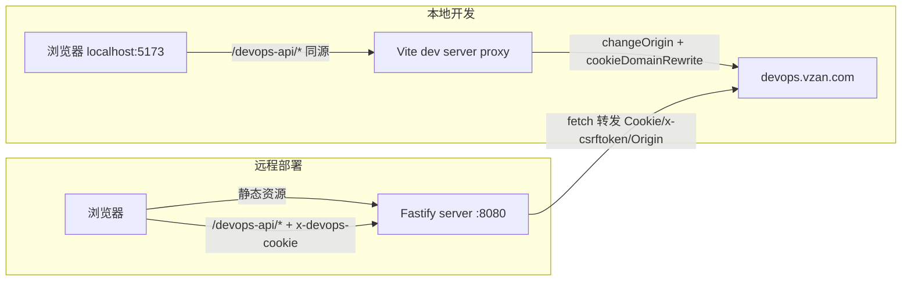

## User Requirements

1. 本地开发：通过 Vite 代理解决跨域/cookie 问题即可（`/devops-api` → `https://devops.vzan.com`）。
2. 远程部署：不部署到 devops.vzan.com，需要新增一个独立 Node.js 服务端项目，包一层转发运维平台接口（托管前端静态文件 + 反代 `/devops-api` 接口）。
3. 登录态：用户自行去运维平台复制 cookie 粘贴到应用内（提供录入入口，存 localStorage）；如果 csrftoken 没有值，只需提示"未登录"，不做登录流程。
4. 服务端框架由 AI 选择合适的 Node.js 框架。

## Product Overview

在现有"工作记录"应用（React + Antd + Vite）的构建按钮功能基础上，补齐本地与远程两种运行方式下的运维平台请求通路：本地走 Vite 代理；远程走自带 Node 服务端（静态托管 + 接口转发 + cookie 透传）。弹窗内新增"登录信息（cookie）"录入口，用户粘贴 cookie 后存 localStorage，构建请求时透传给服务端。

## Core Features

- Vite dev 代理 `/devops-api` 到 devops.vzan.com（含 cookie 域改写），本地浏览器同源直连
- 新增 `server/` Node 服务端：托管 `dist/` 静态文件，反代 `POST /devops-api/deploy/build`、`GET /devops-api/deploy/branch`，将前端传来的 cookie 字符串透传为目标站 `Cookie` 头
- 前端 `src/build.ts` 改造：API 地址统一为相对路径 `/devops-api`；csrftoken 读取顺序为 document.cookie → localStorage 粘贴的 cookie → 提示未登录；请求时携带 `x-devops-cookie` 头
- BuildModal 增加 cookie 粘贴录入区（TextArea + 保存/清除，打开时回填）
- csrftoken 为空时仅提示"未登录运维平台，请先登录后再构建"

## Tech Stack Selection

- 前端（现有，不变）：React 18 + TypeScript + Antd 5 + Vite 5
- 服务端（新增）：**Node.js + Fastify 5（TypeScript）** + `@fastify/static`
- 选型理由：轻量高性能、原生 ESM 友好（与主项目 `type: module` 一致）；静态托管与路由均为官方插件；转发用 Node 18+ 全局 `fetch` 即可，无需引入 http-proxy 等额外依赖，包体积小、部署简单
- 对比 Express：Express 需额外引 `http-proxy-middleware` + `express.static`，依赖更多；Fastify 官方插件链更整洁
- 不选 NestJS：本服务仅 2 个转发端点 + 静态托管，NestJS 过重（用户此前 devops 平台计划里的 NestJS 是另一个项目的选型，不适用此轻量场景）

## Implementation Approach

- **统一路径前缀**：前端所有运维平台请求固定走相对路径 `/devops-api/*`。本地由 Vite proxy 终结并转发到 `https://devops.vzan.com`；远程由 Node 服务终结并转发。前端代码零环境分支。
- **cookie 双通道**：
- 本地代理场景：浏览器 cookie 自动随同源请求携带（Vite proxy `cookieDomainRewrite` 把 devops 域 cookie 改写到 localhost），`credentials: 'include'` 不变。
- 远程场景：用户在 BuildModal 粘贴完整 cookie 字符串存 `localStorage('work-tracker:devops-cookie:v1')`，前端请求时以自定义头 `x-devops-cookie` 带上；Node 服务端取出后作为转发请求的 `Cookie` 头。该头在同源部署下无 CORS 预检问题（同源请求自定义头不受限）。
- **csrftoken 读取**：`getCsrfToken()` 依次尝试 `document.cookie` → localStorage 中粘贴的 cookie 字符串解析 `csrftoken`；均为空 → 构建时仅 `message.warning('未登录运维平台，请先登录后再构建')`。
- **服务端转发**：Fastify 路由 `POST /devops-api/deploy/build`、`GET /devops-api/deploy/branch`，用全局 fetch 转发到 `https://devops.vzan.com` 对应路径，透传 `content-type`、`x-csrftoken`、`Cookie`（来自 `x-devops-cookie`），回传 status + body；设置 `Host`/`Origin`/`Referer` 为 devops 域以过 CSRF 校验。超时 15s，异常返回 502 + 错误信息。
- **性能**：转发为纯 I/O 流式透传，O(1) 内存驻留（body 按需 JSON 序列化，构建 payload 极小）；无轮询、无缓存需求，无性能瓶颈。静态文件由 `@fastify/static` 处理，支持生产量级。
- **安全**：cookie 仅存用户本地 localStorage（用户自己粘贴，符合"用户自行复制"约定）；服务端不落盘、不记日志打印 cookie；`x-devops-cookie` 头禁止跨域转发泄露（服务端仅接受并转发到固定目标域）。

## Implementation Notes

- `vite.config.ts` proxy 配置需 `changeOrigin: true` + `cookieDomainRewrite: { 'devops.vzan.com': 'localhost' }`；若 Firefox 拒收 Secure cookie，后续再在 `configure` 钩子里改写 set-cookie（本次先按 Chrome 可用实现，文档注明）。
- 服务端 `Origin`/`Referer` 必须改写为 `https://devops.vzan.com`，否则 Django CSRF 会 403（参考扩展 content-script 代理的教训）。
- BuildModal 的 cookie 录入区用折叠/次要样式，不打断主流程；保存时 trim 并校验非空。
- 爆炸半径控制：`src/build.ts` 的请求路径改为相对路径后，旧的写死域名逻辑全部移除；App.tsx 无需改动；本地代理不影响其他功能。
- 不做 git 提交（需用户确认）。

## Architecture Design



## Directory Structure

在现有工作记录项目根下新增 `server/` 独立 Node 子项目，并改造前端构建模块与弹窗：

```
mywork/
├── vite.config.ts                    # [MODIFY] 增加 server.proxy：/devops-api → https://devops.vzan.com（changeOrigin、rewrite、cookieDomainRewrite）
├── package.json                      # [MODIFY] 可选：增加 "serve" 脚本提示（如 "cd server && npm start"），不动现有 scripts 语义
├── src/
│   ├── build.ts                      # [MODIFY] BUILD_API/BRANCH_API 改为相对路径 /devops-api/...；getCsrfToken() 增加 localStorage cookie 兜底解析；新增 loadDevopsCookie/saveDevopsCookie/clearDevopsCookie；requestBuild/resolveBuildBranch 请求头带 x-devops-cookie（有值时）
│   └── components/
│       └── BuildModal.tsx            # [MODIFY] 新增"登录信息（cookie）"录入区：Input.TextArea（密码式/可清空）+ 保存/清除按钮，open 时从 localStorage 回填；csrftoken 为空维持现有未登录提示
├── server/
│   ├── package.json                  # [NEW] 独立子项目：fastify、@fastify/static；devDependencies: typescript、tsx、@types/node；scripts: dev(tsx watch)、build(tsc)、start(node dist/index.js)；type: module
│   ├── tsconfig.json                 # [NEW] NodeNext ESM、strict、outDir dist
│   └── src/
│       └── index.ts                  # [NEW] Fastify 实例：注册 @fastify/static 指向 ../dist（前端构建产物，existence 容错）；路由 POST /devops-api/deploy/build 与 GET /devops-api/deploy/branch：取 x-devops-cookie → Cookie 头，透传 x-csrftoken/content-type，强制 Host/Origin/Referer 为 devops 域，15s AbortController 超时，响应回传 status+body；监听 PORT（默认 8080）
└── docs/
    └── build-cross-origin-plan.md    # [MODIFY] 更新：远程方案从"同源子路径/nginx"改为"自带 Node 服务端转发"，记录 cookie 粘贴方案与 Fastify 选型
```

## Key Code Structures

```ts
// src/build.ts —— 前端关键接口（签名级）
export function getCsrfToken(): string;            // document.cookie → localStorage cookie 解析
export function loadDevopsCookie(): string;        // localStorage 读取
export function saveDevopsCookie(v: string): void;
export function clearDevopsCookie(): void;
export async function requestBuild(params: BuildParams): Promise<BuildResult>; // 头: x-csrftoken + x-devops-cookie

// server/src/index.ts —— 服务端转发契约
// POST /devops-api/deploy/build  → POST https://devops.vzan.com/deploy/build
// GET  /devops-api/deploy/branch?app=xxx → GET https://devops.vzan.com/deploy/branch?app=xxx
// 入站头 x-devops-cookie → 出站 Cookie；x-csrftoken 透传；Origin/Referer 固定为 https://devops.vzan.com
```