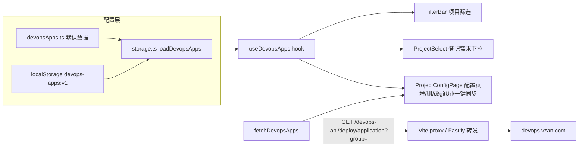

## 用户需求

将「登记需求」的项目选项数据源切换为运维平台应用列表，并把项目列表管理升级为独立的「项目配置」页：

1. 项目数据来源于两个 GET 接口：`https://devops.vzan.com/deploy/application?group=JenkinsFrontweb` 和 `?group=JenkinsPAAS`
2. 接口现有数据作为默认数据，单独放一个配置文件（用户已提供数据，在 `data.json` 中）
3. 新建独立「项目配置页」（顶部工具栏入口，页面级切换，非弹窗），页内有「一键同步」按钮拉取两个接口，与现有数据按项目名去重合并
4. 项目字段包含：分组、项目名、Git 仓库地址（非必填，配置页手动填写）；支持手动新增/删除项目
5. 配置保存到 localStorage，后续再接数据库
6. 构建环境（代码分支）选项新增 `pre-txnj`
7. 废弃现有 44 个默认项目与「项目管理」弹窗

## 产品概述

工作记录工具（需求登记/状态跟踪/运维平台一键构建）新增项目配置能力：项目清单统一来自运维平台，支持一键同步与本地维护（补 Git 地址、增删行），登记需求与筛选时直接选用。配置页与主页面通过顶部入口切换，视觉延续现有 antd 卡片式简洁风格。

## 核心功能

- 项目配置页：应用表格（分组/项目名/别名/Git 地址行内编辑）、手动新增、删除（二次确认）、一键同步（loading + 结果提示）
- 同步合并：按 app 去重，远端新应用追加，已有条目保留本地 gitUrl、更新 alias/group
- 登记需求弹窗项目下拉、筛选栏项目下拉均切换为运维平台数据，选项展示 `app（alias）` 可搜索
- 构建环境下拉新增 `pre-txnj`，构建分支解析为 `origin/pre-txnj`
- 服务端新增 `/devops-api/deploy/application` 转发路由

## 技术栈

沿用现有栈：React 19 + TypeScript + Vite + antd 5 + dayjs；localStorage 持久化；Fastify 转发服务（server/）。无路由库，视图切换用 state。

## 实现方案

### 总体策略

以「配置文件默认数据 + localStorage 用户数据层」替代原手动项目列表：新增 `DevopsApp` 类型（含 `gitUrl`）与默认数据配置文件；storage/hooks 层把 `useProjects` 替换为 `useDevopsApps`（增/删/改/同步合并四个操作）；新增 `ProjectConfigPage` 配置页组件，App 用 `view` state 在主页面与配置页间切换；`build.ts` 新增 `fetchDevopsApps()` 走现有 `/devops-api` 代理。

### 关键决策

- **同步合并语义**：`mergeSynced(remote)` 按 `app` 去重——远端有而本地无的追加（gitUrl 空）；两端都有的保留本地 `gitUrl`、刷新 `alias`/`group`；本地有而远端无的保留（可能是手动新增），返回新增数量用于提示
- **默认数据去重**：两个分组存在同 app（audit-web、yingxiao-pc、yx-web 等），配置文件中按 app 去重，JenkinsFrontweb 优先
- **未登录判断**：接口未登录返回 200 + `{error_code:"user:user_login_failed"}`，必须校验响应为数组，否则抛「未登录运维平台，请先登录」
- **pre-txnj 兼容**：`resolveBuildBranch` 对非 live-h5-2 直接 `'origin/' + env` 天然兼容；live-h5-2 分支循环不命中时回落 env 值，同样兼容，仅需扩展 `BuildEnv` 类型与 `ENV_OPTIONS`
- **旧数据弃用**：`work-tracker:projects:v1` / `seeded` key 不迁移不删除，代码不再引用
- **配置页行内编辑**：Git 地址列用受控 Input，失焦/回车即保存（调用 update 写 localStorage），无需显式保存按钮

### 性能与可靠性

- 同步为低频手动操作，两个 GET 用 `Promise.all` 并行；任一分组失败即整体失败并提示
- 下拉 options 用 useMemo，无额外开销；配置页表格数据量 < 200 行，antd Table 默认分页即可
- `Requirement.items.project` 仍为 string（app 名），存量需求数据与导入导出逻辑完全不受影响

## 实施注意

- 不自动提交代码，需用户确认后才可提交
- 执行第一步先把计划写入 `docs/devops-projects-sync-plan.md`（用户固定协作流程），完成后删除临时文件 `data.json`
- data-testid：本项目无项目级规则，默认不添加（用户提出再加）
- 视图切换时保持外层布局容器（maxWidth 1200 + Card）一致，避免视觉跳动

## 架构设计



## 目录结构

```
mywork/
├── docs/
│   └── devops-projects-sync-plan.md      # [NEW] 本计划执行文档（用户协作流程要求）
├── data.json                              # [DELETE] 临时传输文件，数据提取后删除
├── src/
│   ├── config/
│   │   └── devopsApps.ts                  # [NEW] DevopsGroup/DevopsApp 类型（app/alias/group/gitUrl?）、DEVOPS_GROUPS、DEFAULT_DEVOPS_APPS（从 data.json 提取 app/alias/group，按 app 去重，Frontweb 优先，gitUrl 留空）
│   ├── storage.ts                         # [MODIFY] 删除 DEFAULT_PROJECTS/PROJECT_KEY/SEED_KEY 播种逻辑；新增 work-tracker:devops-apps:v1 的 loadDevopsApps（无存储回退默认数据）/saveDevopsApps
│   ├── build.ts                           # [MODIFY] BuildEnv 加 'pre-txnj'；新增 fetchDevopsApps()：Promise.all 并行拉两分组，校验响应为数组，映射 DevopsApp 并按 app 去重
│   ├── hooks/
│   │   └── useWorkTracker.ts              # [MODIFY] useProjects 替换为 useDevopsApps：DevopsApp[] state 持久化，暴露 apps/add/remove/update/mergeSynced
│   ├── components/
│   │   ├── ProjectConfigPage.tsx          # [NEW] 项目配置页：返回栏+「新增项目」「一键同步」按钮；antd Table 列=分组(Tag)/项目名/别名/Git地址(行内Input失焦保存)/操作(删除Popconfirm)；新增用小弹窗表单（分组Select二选一、项目名必填查重、Git选填）；同步成功提示新增数量，未登录提示先登录
│   │   ├── ProjectSelect.tsx              # [MODIFY] 移除手动添加区域（popupRender/newName/onAddProject）；options 改 app（alias），showSearch + optionFilterProp="label"
│   │   ├── RequirementForm.tsx            # [MODIFY] props projects/onAddProject 改为 apps: DevopsApp[]，其余不变（不加同步按钮）
│   │   ├── FilterBar.tsx                  # [MODIFY] projectOptions: string[] 改 apps: DevopsApp[]，选项 label 带 alias
│   │   ├── BuildControls.tsx              # [MODIFY] ENV_OPTIONS 加 pre-txnj，Select 宽 76→96
│   │   └── ProjectManager.tsx             # [DELETE] 项目管理弹窗整体移除
│   └── App.tsx                            # [MODIFY] 加 view: 'main'|'config' state；工具栏「项目管理」按钮替换为「项目配置」入口；删 ProjectManager 相关引用/state/JSX；useProjects→useDevopsApps；删除导入流程 mergeProjects 调用；view==='config' 渲染 ProjectConfigPage（外层容器样式一致）
└── server/
    └── src/
        └── index.ts                       # [MODIFY] 新增 GET /devops-api/deploy/application 转发，透传 query group（参考 L81-90 branch 路由写法）
```

## 关键代码结构

```ts
// src/config/devopsApps.ts
export type DevopsGroup = 'JenkinsFrontweb' | 'JenkinsPAAS';
export interface DevopsApp {
  app: string;        // 项目名（唯一键）
  alias: string;      // 中文别名
  group: DevopsGroup;
  gitUrl?: string;    // Git 仓库地址，非必填
}
export const DEVOPS_GROUPS: DevopsGroup[] = ['JenkinsFrontweb', 'JenkinsPAAS'];
export const DEFAULT_DEVOPS_APPS: DevopsApp[] = [/* data.json 提取，按 app 去重 */];

// src/hooks/useWorkTracker.ts — useDevopsApps 暴露接口
interface DevopsAppsApi {
  apps: DevopsApp[];
  add: (app: DevopsApp) => boolean;             // app 名重复返回 false
  remove: (appName: string) => void;
  update: (appName: string, patch: Partial<DevopsApp>) => void;
  mergeSynced: (remote: DevopsApp[]) => number; // 按 app 去重合并，保留本地 gitUrl，返回新增数
}

// src/build.ts
export type BuildEnv = 'dev' | 'test' | 'pre' | 'pre-txnj';
export async function fetchDevopsApps(): Promise<DevopsApp[]>; // 非数组响应抛未登录错误
```

## 设计说明

延续项目现有 antd 5 简洁工具风（浅灰背景 #f5f5f5 + 白色 Card 容器，maxWidth 1200 居中），不引入新视觉体系，保证主页面与配置页切换时体验一致。

### 项目配置页（ProjectConfigPage）

- **顶部栏块**：左侧「返回」按钮（ArrowLeftOutlined，type="text"）+ 标题「项目配置」（Typography.Title level=4）；右侧「新增项目」（dashed）+「一键同步」（primary，SyncOutlined，loading 态）
- **统计提示块**：表格上方一行小字展示「共 N 个项目，最近同步时间」（同步时间存 localStorage 一并维护），弱化颜色 #888
- **表格块**：antd Table（bordered，size middle），列依次为：分组（蓝/紫 Tag 区分 JenkinsFrontweb/JenkinsPAAS）、项目名（等宽字体）、别名、Git 仓库地址（行内 Input，占位"选填，如 git@gitlab...:group/repo.git"，失焦/回车保存）、操作（删除文字按钮 + Popconfirm 二次确认）；空态 Empty「暂无项目，点击右上角一键同步」
- **新增弹窗块**：Modal 表单——分组（Select 二选一，必填）、项目名（Input 必填，查重提示「该项目已存在」）、别名（Input 选填）、Git 仓库地址（Input 选填）
- **交互反馈**：同步中按钮 loading 禁用；成功 message.success「同步完成，新增 N 个项目」；未登录/失败 message.error「未登录运维平台，请先登录」；删除成功 message.success

### 主页面改动

- 工具栏「项目管理」按钮原位替换为「项目配置」（SettingOutlined），点击切换整页视图
- 登记需求弹窗与筛选栏的项目下拉选项文案变为 `app（alias）`，其余布局不动