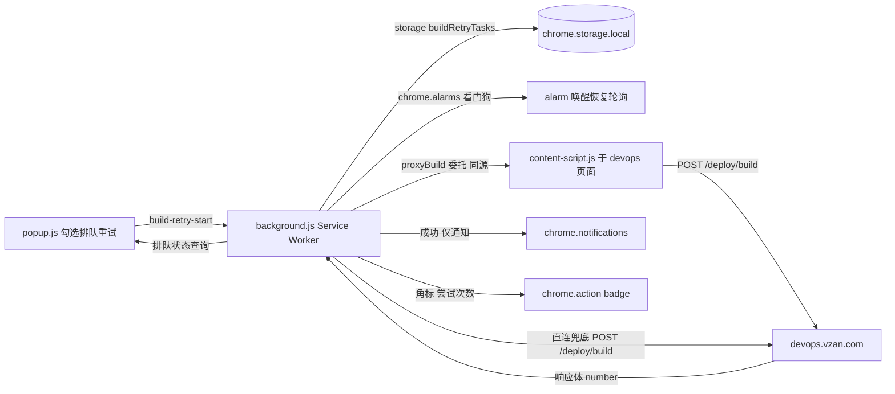

## 产品概述

Chrome 扩展「微赞开发调试工具」（Manifest V3）的构建功能在一次方案升级后出现回归：运维平台（devops.vzan.com）的构建接口已改为「单步」——直接 POST `/deploy/build` 即可，构建编号由服务端在响应体中返回；而扩展内的「排队重试」仍沿用旧的「两步」链路（先 GET 取编号、拿到纯数字才 POST），导致勾选「排队重试」后第一步就失败，构建永远无法真正提交，只能空转到最大次数。

## 核心功能

- 恢复「排队重试」可用性：勾选后点击任意应用按钮，能正常向运维平台提交构建，不再卡在获取构建编号环节。
- 构建请求与成功判定口径统一：排队重试与普通构建（不勾选排队重试）使用完全一致的请求参数、成功判定条件与错误文案提取规则。
- 失败自动重试能力保持：遇到「上一任务尚未完成」等情况，仍按用户设置的间隔秒数持续重试，切换标签页、关闭弹窗、Service Worker 被回收后（alarm 唤醒）都能继续。
- 应用正在构建中的场景可自动排队等待，直到可提交为止；登录态失效（401/403）仍立即终止排队并提示。
- 排队进度反馈保持：扩展图标角标显示尝试次数，popup 内实时显示排队任务状态（尝试次数、最近错误、当前间隔）。
- 构建成功后的反馈调整为系统通知（含应用名、尝试次数、构建编号），不再自动新开构建记录页标签，避免排队成功时突然弹窗；构建记录页链接改为打印到控制台便于人工打开。
- 队列管理行为不变：取消勾选「排队重试」中止全部排队任务，修改「重试间隔」对进行中的任务即时生效。
- 视觉上 popup 界面无需调整，「排队重试」勾选框、间隔输入框、排队状态文字区域保持现有样式与布局。

## 技术栈

- 运行环境：Chrome Extension Manifest V3（`service_worker` 后台 + content script），纯 JavaScript，无构建步骤
- 关键 API：`chrome.runtime.onMessage`、`chrome.storage.local`、`chrome.cookies`、`chrome.tabs`、`chrome.alarms`、`chrome.notifications`、`chrome.action.setBadgeText`
- 目标接口：`https://devops.vzan.com/deploy/build`（POST JSON，`x-csrftoken` 鉴权，`credentials: include`）
- 验证手段：`chrome://extensions` 重载扩展实测 + devops MCP（`get-records`）核对构建记录

## 实现方案

本次修复的核心原则是**单一事实来源**：以 `js/content-script.js` 中已上线的新版 `DeployBuild` 作为唯一基准，把 `js/background.js` 的排队重试链路（`requestBuild` / `attemptBuild`）与供排队调用的 `proxyBuild` 全部对齐到同一套「单步构建」语义。

具体做法：

1. 排队重试不再执行「先 GET `?get_build_number=1` 取编号」这一步（平台改版后该步骤语义已废弃，是当前失败的根因），直接携带 payload POST `/deploy/build`，构建编号从响应体 `body.number` 取。
2. 成功判定、错误文案提取与 `DeployBuild` 保持字面一致，避免两套判定标准再次漂移。
3. 成功后按用户确认改为「仅系统通知 + 控制台打印记录页 URL」，移除自动 `chrome.tabs.create`。
4. 顺带修正既有缺陷：多 devops 标签页循环里 `return await` 会在第一个标签页无 content-script 时直接返回 null，导致不会尝试后续标签页、也不会走直连兜底；同时区分「同源代理请求返回 403」与「后台直连兜底返回 403」两种语义，避免 CSRF 失败被误判为登录态失效而错误终止整个队列。
5. `tools/devops-build.js`（控制台/Node 独立脚本，同样是两步式）同步为单步，保持仓库内三处构建逻辑一致。

关键技术决策与理由：

- **保留 `resolveBuildBranch`（live-h5-2 老项目分支解析）**：按用户确认「不动」，只同步编号相关链路，缩小改动面与回归风险。
- **不做排队调度机制重构**：`setTimeout` + `chrome.alarms` 双调度、`maxAttempts: 120`、badge、存储结构全部保持原样，仅替换「怎么发请求、怎么判成功」。
- **错误分类而非一刀切终止**：401 一律视为登录态失效终止；403 仅在代理（同源）路径下视为登录态失效，直连兜底的 403 更可能是 Origin/CSRF 限制，应继续重试并给出可操作提示。
- **性能与稳定性**：排队任务为秒级轮询，不在热路径上做额外网络往返，删除一次 GET 后每次尝试由 2 次请求降为 1 次，减少一半请求量与失败点；`chrome.storage.local` 读写按尝试次数触发，无 N+1 问题。

## 接口契约

本次改动后，排队重试链路中所有构建请求统一返回同一结构（供 `attemptBuild` 判定）：

```js
// content-script.js 的 proxyBuild 与 background 直连兜底统一返回
{
  ok: boolean,              // res.status === 200 且响应体含 number 或 app
  status: number,           // HTTP 状态码，0 表示网络/异常
  detail: string,           // body.detail 或 body.error_message 或 body.error 或 原始响应
  number: number|string,    // 服务端返回的构建编号，用于通知与日志
  source: 'proxy'|'direct'  // 仅 background 侧标注，用于区分 403 语义
}
```

## 实施要点

- `js/background.js`
- 删除 `fetchBuildNumber` 整个函数及其上方注释块（该接口已废弃，保留会造成误读与再次误用）；`getCsrfToken`、`buildRecordUrl`、`resolveBuildBranch`、`buildPayload` 保留。
- 重写 `requestBuild(task)`：不再前置取编号、不再向 payload 注入 `number`；优先遍历 `https://devops.vzan.com/*` 标签页委托 `proxyBuild`（同源可通过 CSRF），**仅在返回空结果时继续尝试下一个标签页**，全部失败后再退回后台直连 POST；两路结果都补齐 `number`、`source` 字段。
- 错误文案提取顺序对齐 `DeployBuild`：`body.detail` → `body.error_message` → `body.error` → `JSON.stringify(body)`，兜底 `'HTTP ' + res.status`；解析 JSON 用 `catch` 兜底非 JSON 响应（如 403 HTML），避免二次异常。
- `attemptBuild` 成功分支：移除 `chrome.tabs.create`，改为 `console.log` 输出 `buildRecordUrl(task.payload, result.number)` + `notify('构建触发成功', '【app】第 N 次尝试成功 · 构建号 xxxx')`，随后 `removeRetryTask(app)`。
- `attemptBuild` 终止分支：401 直接终止；403 且 `source !== 'direct'` 终止并提示登录态失效；403 且来自直连兜底则视为代理不可用，写入 `lastError`（提示需保持 devops 页面打开或已登录）后按间隔继续重试。
- 更新 `requestBuild` 上方注释块与文件顶部排队重试说明，明确「构建编号由 POST 响应体返回」，避免后续开发者再次引入两步式。
- `js/content-script.js`
- `proxyBuild` 改造为与 `DeployBuild` 一致：成功判定 `res.status === 200` 且响应体存在 `number` 或 `app`；错误文案提取顺序与 `DeployBuild` 相同；成功后回传 `number`，使 background 能拼出真实编号的构建记录页链接。
- 保留 `DeployBuild` 现有实现与其 `window.open` 行为不变（普通构建路径不受影响）；`proxyBuild` 不触发任何 UI 提示，只回传结果给 background，避免重复 toast。
- `tools/devops-build.js`
- 删除 `getBuildNumberOnce` 与 `postBuildOnce` 中的前置校验；payload 移除 `number` 字段；构建编号改为从 POST 响应体读取。
- 返回结构增加 `number`，`buildWithRetry` 成功日志与 `recordUrl` 使用该编号；`openOnSuccess` 默认行为保持（控制台场景仍可自动打开，本次用户确认的是扩展排队场景不跳转）。
- 同步更新文件顶部注释（说明不再需要先获取编号）与相关 JSDoc。
- 改动过程中不得触碰 popup 的 UI 结构、`#build-retry` / `#retry-interval` / `#retry-status` 的既有逻辑、排队的存储键 `buildRetryTasks`、badge 展示与 `maxAttempts: 120`。
- 待确认的关联风险（本次不处理，仅记录）：devops MCP 的 `get-build-app` 描述中仍写着内部「先 GET `get_build_number` 再 POST」两步流程，若平台确已废弃该接口，该工具可能同样失效，建议后续单独确认。
- 安全与资源：所有请求继续使用 `credentials: 'include'` 与 `x-csrftoken`（从 cookie 读取），不新增明文凭据存储；删除一次轮询请求即减少一次跨域往返；通知文案不含敏感信息并限制长度。

## 架构设计

沿用现有分层，不做结构调整：



## 目录结构

本次为既有项目的最小闭环修复，涉及文件如下（该仓库无构建产物目录，均为源码直改）：

```
vzan_crx/
├── js/
│   ├── background.js        # [MODIFY] 排队重试核心。删除 fetchBuildNumber 与两步式前置校验，requestBuild 改为单步 POST 并统一返回 {ok,status,detail,number,source}；修正多标签页循环只在拿到有效结果时返回，否则继续尝试并最终走直连兜底；attemptBuild 成功分支移除 chrome.tabs.create，改为 console.log 记录页 URL + notify 通知（含构建编号）；403 按 source 区分是否视为登录态失效。保留 resolveBuildBranch、buildPayload、badge、alarm 与存储逻辑不变。
│   └── content-script.js    # [MODIFY] 供排队任务调用的代理构建 proxyBuild。成功判定改为 status 200 且响应体含 number 或 app，错误文案提取顺序与 DeployBuild 对齐，并回传构建编号；不产生任何 toast/跳转。DeployBuild 本体与监听分发逻辑保持不变。
├── tools/
│   └── devops-build.js      # [MODIFY] 控制台/Node 独立构建脚本同步单步方案：移除 getBuildNumberOnce 前置步骤，payload 去掉 number，构建编号取自 POST 响应体，成功日志与构建记录页 URL 使用真实编号，更新顶部注释与 JSDoc。
└── docs/
    └── 排队重试构建方案同步-plan.md  # [NEW] 本次修复计划与自测清单落盘。记录根因（986f60d 换新方案未同步排队链路）、改动文件清单、新旧方案差异对照、手动验证步骤与结果，供后续执行与回溯。
```

## Agent Extensions

### MCP

- **devops**
- Purpose: 在修复完成后调用 `get-records` 查询目标应用（如 livepage）的构建历史，核对是否真的产生了新的构建记录（含分支、状态、时间），用于验证「排队重试」已恢复提交能力；必要时用 `get-build-stop` 终止测试期间误触发的构建。
- Expected outcome: 拿到修复前/修复后的构建记录对比，确认修复后排队重试能真实产生新构建记录，而非仅本地显示「尝试中」。