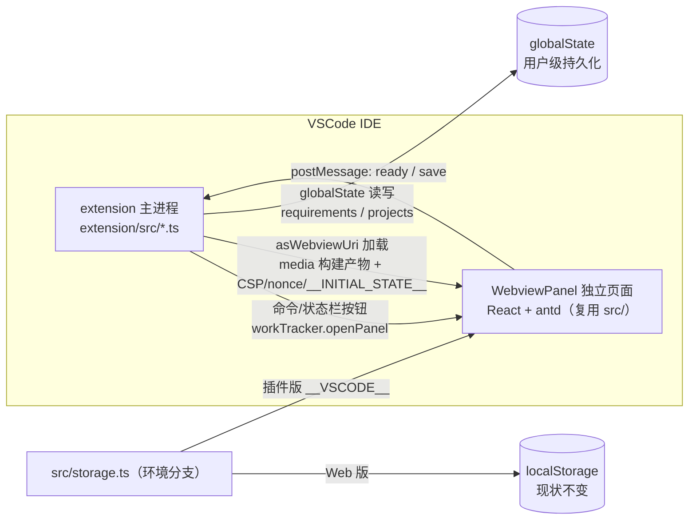

## 产品概述

将现有纯前端「工作记录（work-tracker）」需求交付台账应用封装为 **VSCode 插件**，在 IDE 内以**独立 Webview 页面**运行，同时**保留浏览器 Web 版**。本次交付包含一份完整的开发方案文档（docs/）与一套可运行的插件工程骨架。

## 核心功能

- **可行性分析结论**：技术栈（React + antd 5 + Vite）与 VSCode Webview 天然兼容，纯前端无后端依赖，构建产物可直接加载，非常适合封装；文档中给出完整论证与改造点清单。
- **深度集成方案**：新增 postMessage 通信桥，数据持久化到插件侧 `globalState`（跨窗口、跨会话可靠）；注册命令与状态栏入口打开面板；配置 CSP 安全策略。
- **双版本并存**：插件版复用现有 `src/` 同一套源码，通过构建环境标记（`__VSCODE__`）区分运行形态；Web 版行为与数据（localStorage）完全不变。
- **可运行骨架**：插件工程支持 F5 调试（Extension Development Host）与 `vsce package` 打包 .vsix；提供构建/调试/打包全流程说明。
- **未来扩展方向**：在方案文档中规划 git 工作区分支读取、TAPD OpenAPI 集成（需求/缺陷/工时打通）等演进路径。

## 技术栈

- **复用现有**：React 18 + TypeScript + Vite 5 + Ant Design 5 + dayjs（Webview 内直接运行，零框架替换）。
- **新增（插件侧）**：`@types/vscode`、`@vscode/vsce`（打包 .vsix）；extension 侧用 TypeScript 编译为 CommonJS。
- **构建策略**：Vite 以 `mode` 区分双入口 —— `vite build`（Web 版，输出 `dist/`，现状不变）与 `vite build --mode extension`（插件版，输出 `extension/media/`），并通过 `define: { __VSCODE__ }` 注入环境标记。

## 实现方案

**总体策略**：单仓库双工程。`extension/` 为独立插件工程（独立 package.json + tsconfig），复用 `src/` 前端代码；前端只改 `storage.ts` 一个数据层文件（App.tsx 及各组件零改动），通过环境标记分支 —— Web 版走 localStorage，插件版走 postMessage 桥。extension 侧作为「哑存储」：只管 `globalState` 读写与面板托管，业务逻辑（含默认项目播种）全部留在前端单份实现。

**关键决策与理由**：

1. **单点改造 `storage.ts`**：`loadRequirements/saveRequirements/loadProjects/saveProjects` 是全部数据出入口（App.tsx 的 useState 初始化与 useEffect 保存均调用它们）。在此做环境分支可将改动面收敛到一个文件，Web 版回归风险趋近于零。
2. **初始数据内联注入**：postMessage 是异步的，而 `useState(() => loadRequirements())` 是同步初始化。因此 extension 在生成 webview HTML 时把数据作为 `<script nonce>` 注入 `window.__INITIAL_STATE__`，前端同步读取；后续变更通过 postMessage 异步保存。这样 App.tsx 完全无需改动。
3. **播种逻辑留在前端**：插件版 `loadProjects` 读取 `__INITIAL_STATE__.projects`，若为 `null`（首次使用）则合并 `DEFAULT_PROJECTS` 并立即 postMessage 保存到 extension。默认项目清单只维护一份（`src/storage.ts`），避免跨工程复制。
4. **资源加载方案**：extension 读取 `media/index.html`，将 `./assets/*` 的 src/href 替换为 `webview.asWebviewUri()` 绝对 URI，并注入 CSP meta 与 nonce。若 module 脚本在部分 VSCode 版本加载异常，备选 `vite-plugin-singlefile` 内联方案（文档中注明）。
5. **持久化位置**：采用 `globalState`（用户级、跨工作区共享），契合「个人台账」定位；`retainContextWhenHidden: true` 防止面板隐藏后重载丢失状态。

**性能与可靠性**：数据量为个人台账规模（百级条目），全量同步即可；`bridge.ts` 对 save 消息做微防抖合并（约 200ms）避免 useEffect 连续触发时的消息风暴。extension 侧写入 `globalState` 为同步内存操作，无性能瓶颈。

**CSP 策略**（extension 注入）：

```
default-src 'none';
img-src ${webview.cspSource} https: data:;
style-src ${webview.cspSource} 'unsafe-inline';   /* antd 5 CSS-in-JS 运行时注入 */
script-src 'nonce-${nonce}' ${webview.cspSource};
font-src ${webview.cspSource} data:;
connect-src ${webview.cspSource} http://localhost:* ws://localhost:*;  /* 仅开发热更新需要 */
```

## 实现注意事项

- **环境标记**：`__VSCODE__` 通过 vite `define` 注入为布尔字面量，可被压缩器死代码消除；需新增 `src/vite-env.d.ts` 声明其类型。
- **爆炸半径控制**：`index.html` 不改动；Web 版 storage.ts 行为逐字节保持；导出功能插件版暂沿用 webview 内 Blob 下载（Electron 内核可用），未来再接入 `showSaveDialog`（文档列为增强项）。
- **日志**：extension 侧日志仅保留 `activate` 与面板创建关键节点，避免消息级日志刷屏；不打印 payload 全量数据。
- **兼容性**：`engines.vscode` 设为 `^1.85.0`（保证 `retainContextWhenHidden` 与 webview module 脚本支持）；`localResourceRoots` 限定为 `extension/media` 目录。
- **打包**：`.vscodeignore` 排除 `src/`、`extension/src/`、tsconfig、.git 等；`extension/media` 产物加入 `.gitignore`，打包前先执行 `npm run build:extension`（README 中说明）。

## 架构设计



数据流：extension 打开面板 → 注入 `__INITIAL_STATE__` → 前端同步初始化（首次播种默认项目）→ 用户操作 → useEffect 触发 save → postMessage → extension 写入 globalState → 面板重建时再次注入最新数据。

## 目录结构

```
f:/Develop/www/workRecord/
├── package.json                  # [MODIFY] 新增 build:extension 脚本；devDeps 增加 @vscode/vsce
├── vite.config.ts                # [MODIFY] 按 mode 切换 outDir（dist | extension/media）并注入 define __VSCODE__
├── src/
│   ├── storage.ts                # [MODIFY] 环境分支：插件版改读 __INITIAL_STATE__、写走 bridge.postMessage；播种逻辑保留
│   ├── bridge.ts                 # [NEW] acquireVsCodeApi 封装；ready 握手、save 发送（200ms 防抖合并）
│   └── vite-env.d.ts             # [NEW] 声明 __VSCODE__ 全局常量类型
├── docs/
│   └── vscode-extension-plan.md  # [NEW] 完整开发方案：可行性论证、架构图、postMessage 协议、CSP、构建/调试/打包流程、git/TAPD 扩展规划
├── extension/
│   ├── package.json              # [NEW] 插件 manifest：engines、activationEvents、contributes.commands、main
│   ├── tsconfig.json             # [NEW] 独立 TS 配置（CommonJS 输出 dist/）
│   ├── .vscodeignore             # [NEW] 打包排除 src/、tsconfig、.git 等，保留 media/ 与 dist/
│   ├── src/
│   │   ├── extension.ts          # [NEW] activate：注册 workTracker.openPanel 命令 + 状态栏按钮（单例面板 reveal）
│   │   ├── webview.ts            # [NEW] 创建 WebviewPanel；读 media/index.html 替换资源为 asWebviewUri；注入 CSP/nonce/__INITIAL_STATE__；onDidReceiveMessage 分发
│   │   └── state.ts              # [NEW] globalState 读写 requirements/projects（key 前缀 workTracker.）
│   └── media/                    # [NEW] vite --mode extension 构建产物输出（加入 .gitignore）
├── .vscode/
│   ├── launch.json               # [NEW] F5 调试：Extension Development Host + preLaunchTask 构建
│   └── tasks.json                # [NEW] build:extension 任务供 launch 引用
├── .gitignore                    # [MODIFY] 追加 extension/media 忽略规则
└── README.md                     # [MODIFY] 新增插件版章节：构建、F5 调试、vsce 打包说明
```

## 关键代码结构

```ts
// 前端与插件扩展的 postMessage 协议约定（src/bridge.ts 与 extension/src/webview.ts 共享）
type VscodeBridgeMessage =
  | { type: 'ready' }                                                 // webview 就绪握手
  | { type: 'save'; payload: { requirements: Requirement[]; projects: string[] } }; // 数据变更持久化

// extension 注入 webview 的初始化全局变量（__INITIAL_STATE__）
interface InitState {
  requirements: Requirement[] | null; // null 表示首次使用：前端播种默认项目后 save
  projects: string[] | null;
}
```

`storage.ts` 改造要点（接口签名不变，仅内部分支）：`loadRequirements/loadProjects` 在 `__VSCODE__` 为真时从 `window.__INITIAL_STATE__` 同步读取；`saveRequirements/saveProjects` 改为 `bridge.save({ requirements, projects })` 异步上报；Web 版路径保持现有 localStorage 实现与播种逻辑不变。

## Agent Extensions

### SubAgent

- **code-explorer**
- 用途：实现阶段梳理 `src/` 下所有 `localStorage`、`window`、浏览器 API 引用点（storage.ts / export.ts / 组件），确认桥接改动面完整、无遗漏，并核对 `DEFAULT_PROJECTS` 等常量的引用方。
- 预期结果：输出完整的桥接改造清单，确保 Web 版回归安全与插件版无残留浏览器 API 调用。

### Skill

- **frontend-workflow**
- 用途：生成 `docs/vscode-extension-plan.md` 方案文档时套用其前端工程规范（类型安全、API 契约、安全、性能）约束，覆盖 postMessage 协议定义、CSP 策略与桥接层设计；并按规范组织文档结构。
- 预期结果：方案文档在类型安全、CSP 安全、通信契约三方面满足工程规范，可直接指导后续实现。