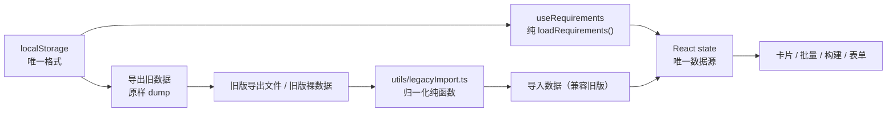

# 需求表单数据丢失修复 + MR 多开修复 + 旧数据兼容逻辑清理

> 状态：已实施（2026-09-21），`npm run build` 零错误。
> 本文档是「数据来源单点化」的权威说明，取代此前散落在 `storage.ts` / `useWorkTracker.ts` / `config/track.ts` 的迁移注释。

## 一、要解决的问题

| # | 现象 | 实质 |
|---|---|---|
| 1 | 编辑需求时新增一个项目分支并保存，再次打开编辑，只见一条空分支（原登记的分支被覆盖） | 表单里 `items` 存在两份状态，回填机制失效 + 空行未被拦截就落库 |
| 2 | 点「批量提交MR」/卡片「提交MR」只打开一个标签页，却提示"已打开 N 个" | 批量打开方式受弹窗配额限制，且无失败感知 |
| 3 | 项目、分支应为必填 | 原实现 `project` 无必填规则，`items` 为空也能保存 |
| 4 | 旧数据兼容逻辑散落各处，运行时到处"猜格式" | 缺少唯一数据来源的边界约定 |

## 二、Bug 1 根因（表单 items 丢失）

`items` 同时存在于两个地方：React state（`requirements`，真数据源）与 antd `Form.List` 的内部 store（副本）。

- `initialValues` **只在挂载时生效**；编辑同一条需求时 `Modal` 的 `key` 不变，更新后的 `initialValues` 不会被重新应用；
- 原实现配了 `preserve={false}`，进一步让"更新后的 initialValues"对 `Form.List` 完全失效；
- 而标量字段（name / tapdUrl / releaseDate / version）因 antd 的受控回填能吃到新值 → 于是出现「表头字段正常、items 区只剩一条空分支」；
- `handleOk` 未过滤空行、`items[].project` 无必填规则、`items` 为空也不拦截 → 脏行以合法数据落库，覆盖原分支。

**修复**：把 `items` 从表单库托管中整体移出。

- 标量字段仍由 antd `Form` 管理（`Form.Item` + `rules`，保留自动聚焦与红字）；
- `items` 由本地 `useState` 独占（`ItemDraft { key, id?, project?, branch }`），新增/删除/修改都是纯数组操作；
- 弹窗打开时 `useEffect` 内一次性回填（`form.setFieldsValue` + `setItems`）；
- 提交顺序：`form.validateFields()` 校验标量 → 剥离「项目与分支都没填」的整行 → 剥离后为空则拦提交 → 逐行必填校验（不合格行 `status="error"` + 行下红字 + 汇总提示）→ 通过后把剥离结果同步回界面再 `onSubmit`。

数据流变为单向：`editing`（props）→ 打开时回填 → 本地 CRUD → 提交时整组交回 `onSubmit` → `upsert` 落库。移除 `Form.List` / `initialValues` / `preserve` / `Form.ErrorList` 后，"两份状态不同步"这一整类问题从根上消失。

## 三、Bug 2 根因（MR 只开一个标签页）

原 `openInNewTab` 用动态 `<a target="_blank">` + 同步 `a.click()`，且点击后**同步 `remove()`**；函数无返回值，调用方无条件提示成功。

**修复**（`utils/openTabs.ts` 重写）：

1. **不用 `window.open`**。浏览器弹窗拦截器对「一次用户手势」只放行一个 `window.open`，**先调用它会把本次手势的配额吃掉**，后续链接（无论何种方式）都打不开——这正是"只打开一个"的直接原因。因此改用「程序化点击 `<a target="_blank">`」，它属于元素发起的导航，不受该配额限制。
2. **不用 `display: none`**：部分内核不把不可见元素视为用户导航；改为透明定位（`position: fixed` + `opacity: 0` + 1×1 + `pointerEvents: none`）。
3. **不同步移除节点**：`click()` 之后在下一个宏任务再 `remove()`；期间用模块级 `Set` 强引用锚点，防止被 GC 提前回收导致导航中断。
4. **如实反馈**：锚点路径无法回传"是否真的弹出"（没有句柄可判断），因此提示语措辞为「已发起打开 N 个 MR 页面」，并在 N > 1 时附一行「若浏览器只放行了一个标签页，可到 MR 清单逐条打开」——`BatchPanel` 里现成的 `<a href target="_blank">` 清单即为兜底通道。
5. **统一入口 + 阈值确认**：卡片「提交MR」与面板「批量提交MR」共用 `openMrTabs()`；待打开数 > 10（`MR_OPEN_CONFIRM_THRESHOLD`）时先 `modal.confirm`，确认按钮的点击本身即一次新的用户手势，循环在其同步回调内执行。

> 与初版方案的差异：原计划"首选 `window.open` + 句柄判断是否被拦截，`<a>` 兜底"。实施时改为**纯锚点方案**——因为 `window.open` 一旦先行成功，就会耗尽本次手势的配额，使后续锚点兜底也失效，等于保底只开一个，恰好复现要修的 bug；同时 `window.open(url, '_blank', 'noopener')` 在 Chrome 恒返回 `null`，无法用于判断拦截。代价是失去"确认打开数"的信号，改为在文案上如实表述并提供清单兜底。

## 四、数据来源单点化（运行时零兼容）

### 4.1 原则

- 内存与 localStorage 中**只存在一种格式**（`types.ts` 的 `Requirement`）；
- 所有旧格式识别与转换**集中在导入边界**（`utils/legacyImport.ts`），全部为无副作用纯函数，不参与渲染；
- `loadRequirements()` 只做 `JSON.parse` + 异常兜底 `[]`，运行时不校验格式、不迁移。

### 4.2 旧版数据逃生闭环

1. 旧版环境点「**导出旧数据**」→ 得到 `{ version: 'legacy-raw', exportedAt, raw }`，`raw` 是 localStorage 原始字符串（无损，即使已损坏也能取回）；
2. 新版环境点「**导入数据（兼容旧版）**」→ 自动解包并转换为当前格式；
3. 若浏览器中现存的仍是旧格式，页面顶部给出一条可关闭的提示条指引上述闭环（仅提示，**不自动改动数据**）。

### 4.3 导入契约（同一入口识别四种输入）

| 输入 | 来源 |
|---|---|
| 朴素数组 `[{...}]` | 旧版 localStorage 原始值被另存为文件 |
| `{ version: 1, requirements: [...] }` | 旧版「导出数据」 |
| `{ version: 2, requirements: [...] }` | 当前版本「导出数据」 |
| `{ version: 'legacy-raw', raw: '<string>' }` | 当前版本「导出旧数据」（递归解包后再走同一管线） |

### 4.4 关键坑：不能靠 `envWeizan` 键是否存在判断旧格式

`JSON.stringify` 会丢弃值为 `undefined` 的键，因此「该轨已被用户移除」在持久化/导出后**表现为键缺失**，与「旧格式数据无此键」不可区分。

- **旧数据检测**必须基于旧格式特征字段：`currentEnv` / `buildEnv` / `versionPipeline` 之一存在；或（更早版本）两轨字段都不存在且带旧 `status`。
- 归一化同理：仅当记录命中上述特征时才走历史拆轨逻辑，否则缺键一律按「该轨已移除」处理。

### 4.5 唯一格式的数据契约

`src/types.ts`：

- 新增 `TrackEnvState = BuildEnv | null | undefined`，并写明三态语义：
  - `undefined` = 该轨已被用户手动移除（卡片不渲染该轨，"移除轨 / +轨恢复"交互完整保留）；
  - `null` = 参与但未开始；
  - 环境值 = 已推进到该环境。
- `Requirement`：删除旧字段 `status` / `buildItems`；`version`、`envWeizan`、`envStar` **由可选改为必填键**（漏写字段变成编译期错误，而不是被静默解释成"该轨已移除"）；
- 新增 `RequirementInput`（原 `RequirementFormValues` 上移到 `types.ts`），消除「hook 反向依赖组件类型」的分层瑕疵。

### 4.6 已删除的兼容逻辑清单

| 文件 | 删除内容 |
|---|---|
| `hooks/useWorkTracker.ts` | `migrateToDualTrackOnce` / `stripLegacyTrackTargetsOnce` 及两个标记键；初始化简化为 `loadRequirements()`；`upsert` 去掉 `buildItems` 透传 |
| `storage.ts` | `migrateLegacyBuildPlan` / `migrateDevopsAppsExcludeFlag` 及旧键常量；新增 `loadRequirementsRaw()`（仅供「导出旧数据」） |
| `config/track.ts` | `backfillRequirement` / `LEGACY_STATUS_TO_ENV`（能力移交 `utils/legacyImport.ts`），文件回归纯派生函数 |
| `pages/QuickBuildPage.tsx` | `loadState` 中「旧扁平 `projects` 迁移为批次」分支 |
| `export.ts` | 导入解析与校验整体移交 `utils/legacyImport.ts`；`downloadJson` 收为内部实现，对外提供 `exportAll` / `exportArchive` / `exportLegacyRaw` |
| `pages/RequirementListPage.tsx` | 过期迁移注释；工具栏文案与按钮 |

## 五、改动文件

**新增**

- `src/utils/legacyImport.ts`：`LEGACY_STATUS_TO_ENV`、`normalizeRequirement()`、`hasLegacyData()`、`parseImportFile()`

**修改**

- `src/types.ts`（唯一数据契约 + `TrackEnvState` + `RequirementInput`）
- `src/export.ts`（导出 v2 + `exportLegacyRaw` + `exportArchive`）
- `src/storage.ts`（删迁移 + `loadRequirementsRaw`）
- `src/hooks/useWorkTracker.ts`（删迁移链 + `RequirementInput`）
- `src/config/track.ts`（删迁移能力）
- `src/components/RequirementForm.tsx`（items 受控 + 行级必填）
- `src/components/ProjectSelect.tsx`（新增可选 `status` 透传）
- `src/utils/openTabs.ts`（锚点可靠多开）
- `src/pages/RequirementListPage.tsx`（统一 MR 入口 + 阈值确认 + 工具栏 + 旧数据提示条）
- `src/pages/QuickBuildPage.tsx`（删旧结构迁移分支）

**未改动**：`batch.ts`、`RequirementCard`、`BuildPanel`、`ArtifactList`、`useBuildTasks`、`build.ts`；localStorage 键名与构建/制品请求链路均不变。

## 六、验收步骤

### 表单（Bug 1 + 必填）

1. 登记一条需求，填 2 个「项目 + 分支」→ 保存；
2. 打开编辑：应完整回显 2 行；点「添加项目分支」再填 1 行 → 保存；
3. 再次打开编辑：应看到 3 行（**不再出现"只剩一条空分支"**）；
4. 点「添加项目分支」但不填任何内容 → 保存：空行被剥离，正常保存；
5. 清空某一行的项目（或分支）→ 保存：该行控件红色描边 + 行下红字，阻止保存；
6. 删除全部行 → 保存：提示「请至少添加一个项目分支」。

### MR 多开（Bug 2 + 阈值）

7. 登记一条含 3+ 个已配置 `gitUrl` 项目的需求，勾选卡片 → 面板「批量提交MR」：应同时打开多个标签页；
8. 在需求上挂 11+ 个此类项目 → 点批量 MR：应先弹「确认打开大量标签页？」，确认后再打开；
9. 卡片上的「提交MR」走同一提示与阈值逻辑；
10. 提示语为「已发起打开 N 个 MR 页面」；若只弹出一个，可从面板 MR 清单逐条点开。

### 数据来源单点化

11. 工具栏出现「导入数据（兼容旧版）」与「导出旧数据」；
12. 点「导出旧数据」→ 得到 `version: 'legacy-raw'` 文件；用「导入数据（兼容旧版）」导入同一文件 → 数据正常、无重复 id 冲突提示；
13. 构造一条含 `currentEnv`（如 `pre`）的旧格式记录放入导入文件 → 导入后该需求 `envWeizan === 'pre'`；含 `versionPipeline: 'starOnly'` 的记录导入后微赞轨被移除；
14. 浏览器 localStorage 里若存在旧格式记录 → 页面顶部出现可关闭提示条。

## 七、验证记录（2026-09-21）

- `npm run build`（含 `tsc --noEmit`）：**零错误**通过。
- `utils/legacyImport.ts` 纯函数用真实数据跑断言，9 组全部通过，覆盖：
  1. 旧 `currentEnv` 拆到对应轨（`pre` → 微赞轨，星享轨 `null`）；
  2. 旧「已发布」→ 两轨都置末段（`master` + `prod-txnj`）；
  3. `versionPipeline` 的 `starOnly` / `weizanOnly` 分别移除对应轨；星享轨环境反查正确；
  4. **关键回归**：新格式记录（微赞轨键缺失 = 已移除）即便残留旧 `status`，也不得被当成旧数据复活该轨；
  5. `undefined` 经 `JSON.stringify` 往返后仍保持「已移除」；
  6. 缺 `id` / 空 `name` / 非 http(s) 的 `tapdUrl` / `items` 为空 → 判废并计入 `invalidCount`；
  7. `hasLegacyData` 判定（含"有双轨键即非旧数据"）；
  8. 四种输入形态（朴素数组 / v1 / v2 / legacy-raw）均能解析并完成拆轨；
  9. 非 JSON / 结构不可识别 / `legacy-raw` 缺 `raw` → 抛出可读错误。
- 待人工验证（需浏览器操作）：表单编辑回显（Bug 1）与 MR 多标签页打开（Bug 2）两条 UI 路径，见第六章第 1-13 步。
