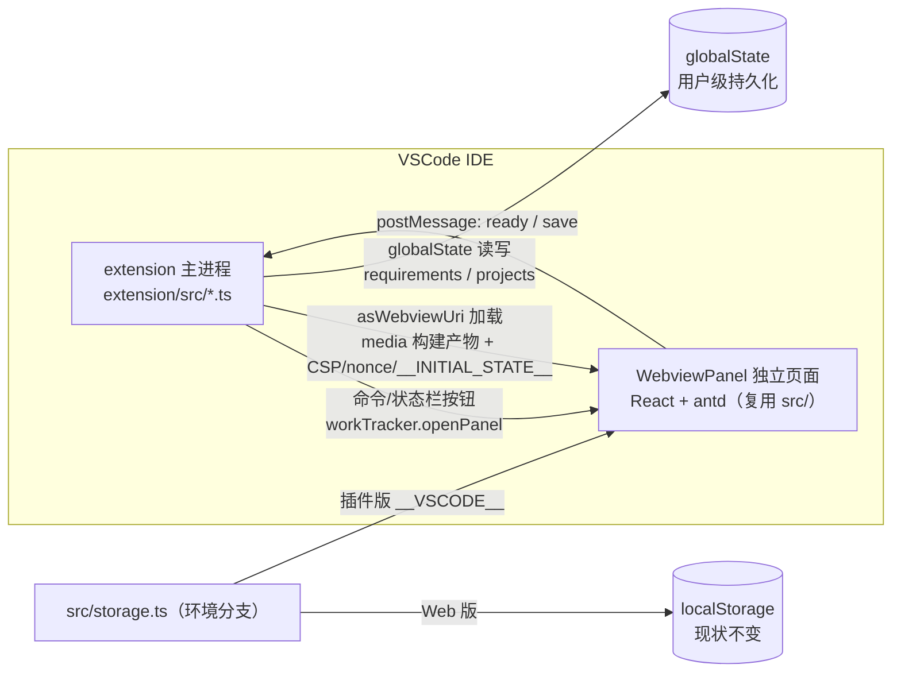

# VSCode 插件封装开发方案：工作记录（work-tracker）

> 版本：v1.0 · 状态：可执行 · 配套代码：`extension/` 插件工程 + `src/` 桥接改造

## 1. 背景与目标

「工作记录（work-tracker）」是当前以 **React 18 + TypeScript + Vite 5 + Ant Design 5** 构建的纯前端需求交付台账应用，数据全部存储在浏览器 `localStorage`。本方案将该应用封装为 **VSCode 插件**，使其在 IDE 内以**独立 Webview 页面**运行，同时**保留浏览器 Web 版**，二者共用同一套 `src/` 源码。

### 1.1 交付物

| 交付物 | 说明 |
| --- | --- |
| 本文档 | 完整开发方案：可行性论证、架构、通信协议、构建/调试/打包流程、扩展规划 |
| 插件工程骨架 | `extension/` 独立工程（manifest + 主进程 + webview + 状态存储），可 F5 调试、可 `vsce package` 打包 |
| 前端桥接改造 | `src/storage.ts` 环境分支 + 新增 `src/bridge.ts`、`src/vite-env.d.ts`，Web 版零行为变化 |
| 工程配置 | 根 `vite.config.ts` 双 mode 构建、`.vscode/launch.json` + `tasks.json`、`.gitignore`、README 插件章节 |

### 1.2 非目标（本期不实现，见 §10 扩展规划）

- git 工作区/分支信息读取
- TAPD OpenAPI 集成（需求/缺陷/工时打通）
- 导出走插件侧 `showSaveDialog`（本期沿用 webview 内 Blob 下载，Electron 内核可用）

## 2. 可行性分析

### 2.1 有利条件

| 维度 | 现状 | 结论 |
| --- | --- | --- |
| 技术栈兼容性 | React 18 + antd 5 + Vite 5 | Webview 是嵌入式浏览器，可完整运行 React + antd 5，**零框架替换** |
| 后端依赖 | 纯前端，无接口调用 | 无 CORS、无服务端依赖，插件本地运行形态完全匹配 |
| 使用场景 | 开发者日常台账，与项目/分支/TAPD 强相关 | 常驻 IDE 侧边栏/面板自然；未来可集成 git 工作区、右键菜单 |
| 构建产物 | 单页无路由、`base: './'` | `vite build` 产物可被 webview 直接加载 |
| 数据层收敛 | localStorage 全部封装在 `src/storage.ts` | 改造面可收敛到**一个数据层文件**，Web 版回归风险趋近于零 |

### 2.2 浏览器 API 引用点盘点（改造面清单）

子代理梳理结论：`src/` 下浏览器 API 全部集中在 4 个文件，**组件层 6 个组件 100% 干净**：

| 文件 | API | 插件版处理 |
| --- | --- | --- |
| `src/storage.ts` | `localStorage`（getItem/setItem） | **本期改造核心**：环境分支 → 插件版改读 `__INITIAL_STATE__`、写走 postMessage 桥 |
| `src/App.tsx` | `crypto.randomUUID()`（2 处） | Webview 有完整 `window.crypto`，**无需处理** |
| `src/export.ts` | `Blob` / `URL.createObjectURL` / `document` | Webview 的 Electron 内核可用，**本期沿用**；未来接 `showSaveDialog` |
| `src/main.tsx` | `document.getElementById('root')` | Webview 中可用，**无需处理** |

> 结论：只需改造 `storage.ts` 一个文件 + 新增 `bridge.ts`/`vite-env.d.ts`，`App.tsx` 与各组件**零改动**。

### 2.3 必须处理的改造点（3 项）

1. **CSP 策略**：VSCode 强制 webview 配置 CSP。antd 5 为 CSS-in-JS 运行时注入，需放行 `style-src 'unsafe-inline'`；Vite 产物为外部脚本（无 inline script），对 `script-src` 友好（nonce 策略）。
2. **环境桥接**：`window.acquireVsCodeApi()` 仅在插件环境存在。通过 Vite `define` 注入 `__VSCODE__` 布尔字面量区分 Web/插件形态，Web 版降级跳过 postMessage。
3. **数据持久化可靠性**：Webview 面板销毁/重建时 localStorage 不可靠，深度集成要求通过 postMessage 将数据双向同步到插件侧 `globalState`（用户级、跨窗口、跨会话可靠）。

## 3. 总体架构

### 3.1 架构图



### 3.2 双工程结构

单仓库双工程：

- **根工程**（Web 版 + 构建器）：React 前端 + Vite。`vite build` 输出 `dist/`（现状不变）；`vite build --mode extension` 输出 `extension/media/`（插件 webview 产物）。
- **`extension/` 独立插件工程**：独立 `package.json` + `tsconfig.json`，TS 编译为 CommonJS 输出 `extension/dist/`。extension 侧是「哑存储」：只管 `globalState` 读写与面板托管，业务逻辑（含默认项目播种）全部留在前端单份实现。

### 3.3 数据流

```
extension 打开面板
  → 读取 globalState（requirements/projects）
  → 生成 webview HTML：替换资源为 asWebviewUri + 注入 CSP/nonce/__INITIAL_STATE__
  → 前端同步初始化（首次：播种默认项目并立即 save 上报）
  → 用户操作 → React state 变更 → useEffect 触发 save
  → bridge.postMessage('save', { requirements, projects })（200ms 防抖合并）
  → extension 写入 globalState
  → 面板重建时再次注入最新数据
```

## 4. 通信协议（postMessage 契约）

> 类型定义在前端 `src/bridge.ts` 与插件 `extension/src/webview.ts` 各维护一份（跨工程无法共享 import，需人工保持同步，字段变更时以本文档为准）。

### 4.1 Webview → Extension

```ts
type VscodeBridgeMessage =
  | { type: 'ready' } // webview 就绪握手（面板加载完成、数据初始化完毕）
  | {
      type: 'save';
      payload: { requirements: Requirement[]; projects: string[] };
    }; // 数据变更持久化（防抖合并后上报）
```

### 4.2 Extension → Webview（注入式，非 postMessage）

由于 `useState(() => loadRequirements())` 是同步初始化、postMessage 是异步的，extension 采用**内联注入**方式把初始数据放进 `__INITIAL_STATE__` 全局变量：

```html
<script nonce="${nonce}">
  window.__INITIAL_STATE__ = { requirements: ..., projects: ... };
</script>
```

```ts
interface InitState {
  requirements: Requirement[] | null; // null 表示首次使用：前端播种默认项目后 save
  projects: string[] | null;
}
```

### 4.3 消息语义

| 消息 | 触发时机 | 处理 |
| --- | --- | --- |
| `ready` | 前端完成初始渲染后 | extension 仅打日志，无需响应 |
| `save` | 任一数据变更（防抖 200ms 合并） | extension 写入 globalState 对应 key |

## 5. 关键设计决策

### 5.1 单点改造 `storage.ts`

`loadRequirements` / `saveRequirements` / `loadProjects` / `saveProjects` 是全部数据出入口（App.tsx 的 `useState` 初始化与 `useEffect` 保存均调用）。在此做环境分支可将改动面收敛到一个文件：

```ts
export function loadRequirements(): Requirement[] {
  if (IS_VSCODE) return window.__INITIAL_STATE__?.requirements ?? [];
  return loadJson<Requirement[]>(REQ_KEY, []);
}

export function saveRequirements(list: Requirement[]): void {
  if (IS_VSCODE) {
    bridge.save({ requirements: list, projects: getProjectsSnapshot() });
    return;
  }
  saveJson(REQ_KEY, list);
}
```

> 注意：`saveRequirements` / `saveProjects` 在插件版需合并为一次 `save` 消息（payload 同时携带两数组），避免两处 `useEffect` 触发两次消息。由 `bridge.save()` 内部管理最近快照实现合并。

### 5.2 初始数据内联注入（`__INITIAL_STATE__`）

- **原因**：`useState(fn)` 同步初始化无法等待异步 postMessage 应答。
- **做法**：extension 生成 HTML 时注入 `<script nonce>` 内联 JSON；前端同步读取。
- **Web 版兼容**：`window.__INITIAL_STATE__` 为 `undefined`，前端代码 `?? []` 兜底。

### 5.3 播种逻辑留在前端

插件版 `loadProjects` 读取 `__INITIAL_STATE__.projects`，若为 `null`（首次使用）则合并 `DEFAULT_PROJECTS` 并立即 `bridge.save()` 上报到 extension。默认项目清单只维护一份（`src/storage.ts`），避免跨工程复制。

### 5.4 资源加载方案

extension 读取 `extension/media/index.html`，将 `./assets/*` 的 `src`/`href` 替换为 `webview.asWebviewUri()` 绝对 URI，并注入 CSP meta 与 nonce。

- **首选**：标准 Vite 产物 + asWebviewUri 外链资源。
- **备选**：若 module 脚本在部分 VSCode 版本加载异常，改用 `vite-plugin-singlefile` 内联产物（文档注明即可，本期不实现）。

### 5.5 持久化位置：`globalState`

- 采用 `globalState`（用户级、跨工作区共享），契合「个人台账」定位。
- `retainContextWhenHidden: true` 防止面板隐藏后重载丢失状态。
- key 前缀 `workTracker.`（`workTracker.requirements` / `workTracker.projects`）。

### 5.6 性能与可靠性

- 数据量为个人台账规模（百级条目），全量同步即可，无需增量 diff。
- `bridge.ts` 对 `save` 消息做 **200ms 防抖合并**，避免 useEffect 连续触发时的消息风暴。
- extension 侧写入 globalState 为同步内存操作，无性能瓶颈。
- 防抖窗口期面板被关闭可能丢失最后一次变更：`bridge.ts` 在 `window.addEventListener('beforeunload')` 时立即 flush 剩余变更（增强项，见 §8）。

### 5.7 日志规范

- extension 侧仅保留 `activate` 与面板创建关键节点日志，**不打印 payload 全量数据**（避免刷屏与敏感信息）。
- 前端 `bridge.ts` 不做 console 输出。

## 6. CSP 安全策略

> 安全规则为硬约束。VSCode webview 必须配置 CSP；以下策略同时满足 antd 5 CSS-in-JS 与 Vite 外部脚本加载。

```
default-src 'none';
img-src ${webview.cspSource} https: data:;
style-src ${webview.cspSource} 'unsafe-inline';   /* antd 5 CSS-in-JS 运行时注入 */
script-src 'nonce-${nonce}' ${webview.cspSource};
font-src ${webview.cspSource} data:;
connect-src ${webview.cspSource} http://localhost:* ws://localhost:*;  /* 仅开发热更新需要 */
```

要点：

- `default-src 'none'` 兜底，最小权限。
- `script-src` 仅放行带 nonce 的内联脚本（`__INITIAL_STATE__` 注入）与 `webview.cspSource`（外部模块脚本），杜绝任意内联脚本执行（XSS）。
- `style-src 'unsafe-inline'` 为 antd 5 CSS-in-JS 所必需。
- `localResourceRoots` 限定为 `extension/media` 目录，禁止 webview 访问插件外文件。

## 7. 构建流程

### 7.1 双 mode 构建

根 `vite.config.ts` 按 `mode` 切换输出目录与注入环境标记：

```ts
export default defineConfig(({ mode }) => ({
  base: './',
  plugins: [react()],
  define: { __VSCODE__: mode === 'extension' },
  build: {
    outDir: mode === 'extension' ? 'extension/media' : 'dist',
    emptyOutDir: true,
  },
}));
```

- `npm run build`（默认 mode=production）→ Web 版产物 → `dist/`，现状不变。
- `npm run build:extension`（`vite build --mode extension`）→ 插件版产物 → `extension/media/`。
- `__VSCODE__` 为布尔字面量，被压缩器死代码消除，Web 版产物不含插件分支代码。

### 7.2 脚本汇总

| 命令 | 说明 |
| --- | --- |
| `npm run dev` | Web 版开发（现状不变） |
| `npm run build` | Web 版构建（tsc --noEmit + vite build，现状不变） |
| `npm run build:extension` | `tsc --noEmit && vite build --mode extension` 产出插件版媒体资源 |
| `npm run build:plugin` | `npm run build:extension` + `cd extension && npm run compile` 产出插件全部产物 |

## 8. 调试流程（F5）

`.vscode/launch.json` + `.vscode/tasks.json` 实现一键 F5：

- **preLaunchTask**：`build:extension`（构建插件版 webview 产物 + extension 主进程编译）。
- **type**：`extensionHost`（Extension Development Host）。
- **args**：`--extensionDevelopmentPath=${workspaceFolder}/extension`。

F5 后弹出新的 VSCode 窗口（扩展宿主），通过命令面板执行 **「Work Tracker：打开工作记录」** 或点击状态栏图标打开面板。

## 9. 打包流程（vsce）

```bash
# 1. 构建插件全部产物（media + extension/dist）
npm run build:plugin

# 2. 在 extension/ 目录打包 .vsix
cd extension
npx @vscode/vsce package

# 3. 产物 work-tracker-<version>.vsix，可直接安装或发布到 VSCode Marketplace
```

`.vscodeignore` 排除 `src/`、`extension/src/`、`tsconfig.json`、`.git` 等开发文件，仅保留 `media/`、`dist/`、`package.json`、`README.md`、`LICENSE`。

## 10. 未来扩展方向

### 10.1 git 工作区集成（P1）

- 读取当前工作区分支：`vscode.workspace` + `git` extension API（`vscode.extensions.getExtension('vscode.git')`）。
- 登记需求时预填「项目 + 分支」：通过 `postMessage` 从 extension 侧拉取当前分支，写入表单 `items[].branch`。
- 右键菜单：在编辑器/资源管理器选中内容时快捷登记。

### 10.2 TAPD 集成（P1）

- 现状：需求字段已含 `tapdUrl`（手工粘贴）。
- 演进：接入 TAPD OpenAPI，从 URL 解析 `workspace_id` / `story_id`，自动拉取需求标题、状态；登记后一键同步状态流转。
- 交互方式：extension 侧调 TAPD HTTP API（避免 webview 直连 CORS），`postMessage` 透传结果。

### 10.3 导出体验增强（P2）

- 导出改走插件侧 `showSaveDialog` + `workspace.fs.writeFile`，替代 webview 内 Blob 下载，落盘位置可控、文件名可改。
- 归档清理沿用现有「导出并清理」交互，仅替换落盘方式。

### 10.4 其他

- 面板图标（activity bar 视图容器替代当前纯命令入口）。
- 状态栏展示今日登记数。
- 数据加密存储（`globalState` 默认明文，个人台账无敏感诉求，按需启用）。

## 11. 改造点清单（文件级）

### 11.1 前端（根工程）

| 文件 | 操作 | 说明 |
| --- | --- | --- |
| `vite.config.ts` | 修改 | 按 mode 切 outDir + 注入 `__VSCODE__` |
| `src/storage.ts` | 修改 | 环境分支：插件版改读 `__INITIAL_STATE__`、写走 `bridge.save()`；播种逻辑保留 |
| `src/bridge.ts` | 新增 | acquireVsCodeApi 封装、ready 握手、save 防抖合并、beforeunload flush |
| `src/vite-env.d.ts` | 新增 | `declare const __VSCODE__: boolean` 与 `window.__INITIAL_STATE__` 类型 |
| `package.json` | 修改 | 新增 `build:extension`、`build:plugin` 脚本；devDeps 增加 `@vscode/vsce` |
| `.gitignore` | 修改 | 追加 `extension/media/`、`extension/dist/`；放行 `.vscode/launch.json`、`.vscode/tasks.json` |

### 11.2 插件工程（`extension/`）

| 文件 | 操作 | 说明 |
| --- | --- | --- |
| `package.json` | 新增 | manifest：`engines.vscode ^1.85.0`、命令、`main: dist/extension.js` |
| `tsconfig.json` | 新增 | CommonJS 输出 `dist/`，strict |
| `.vscodeignore` | 新增 | 打包排除开发文件 |
| `src/extension.ts` | 新增 | `activate`：注册命令 + 状态栏按钮，单例面板 reveal |
| `src/webview.ts` | 新增 | 创建面板；读 HTML 替换资源 URI；注入 CSP/nonce/`__INITIAL_STATE__`；消息分发 |
| `src/state.ts` | 新增 | globalState 读写 `workTracker.requirements` / `workTracker.projects` |
| `media/` | 自动 | vite `--mode extension` 产物（gitignore） |

### 11.3 根配置

| 文件 | 操作 | 说明 |
| --- | --- | --- |
| `.vscode/launch.json` | 新增 | F5 调试 Extension Development Host |
| `.vscode/tasks.json` | 新增 | `build:extension` 预构建任务 |
| `README.md` | 修改 | 新增插件版章节：构建、F5 调试、vsce 打包 |

## 12. 兼容性与注意事项

- **`engines.vscode`**：`^1.85.0` —— 保证 `retainContextWhenHidden` 与 webview module 脚本支持。
- **环境标记**：`__VSCODE__` 通过 Vite `define` 注入为布尔字面量，可被压缩器死代码消除；Web 版产物不含插件分支代码。
- **爆炸半径控制**：`index.html` 不改动；Web 版 `storage.ts` 行为逐字节保持；导出功能插件版暂沿用 webview 内 Blob 下载。
- **CSP 开发环境**：`connect-src http://localhost:* ws://localhost:*` 仅开发热更新需要，生产产物无此依赖（如不放行也不影响运行）。
- **双工程类型共享**：`Requirement` / `Status` 类型在 `extension/src` 中以独立声明维护（插件侧只做透传与存取，不做业务校验），避免根工程与插件工程 tsconfig 互相 include 的复杂性。
