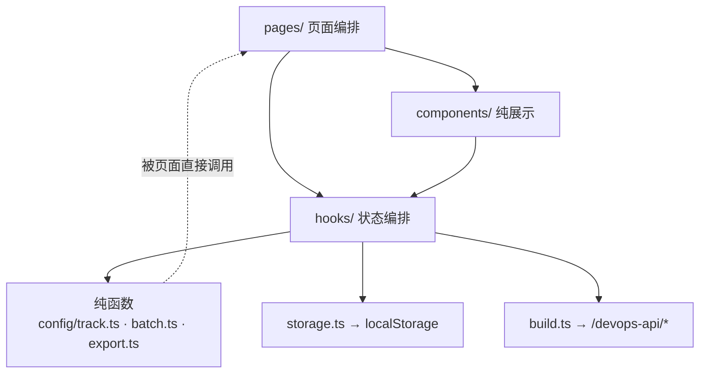
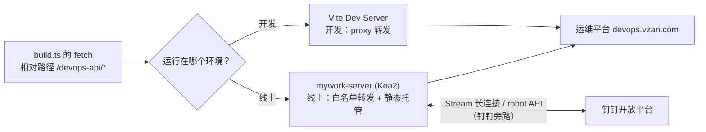
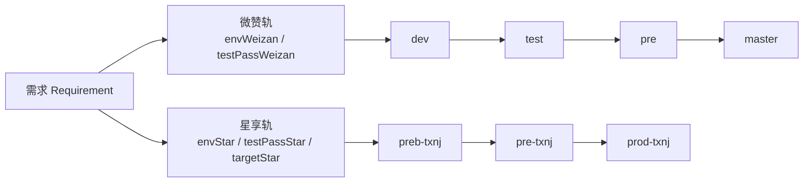
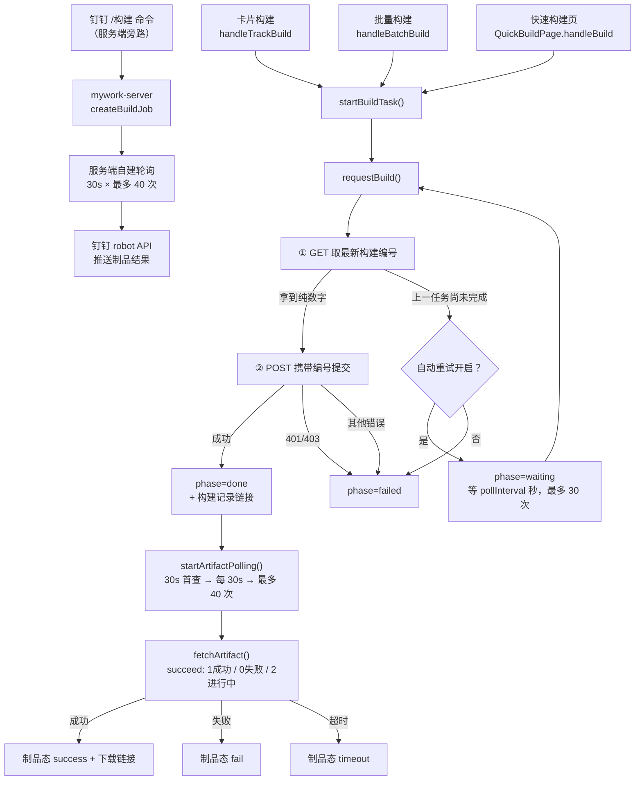

# work-tracker 架构导读

> **这份文档解决什么**：让你不逐行读代码也能掌握项目全貌，改动时能立刻定位落点。
> **基准版本**：2026-09-21（表单受控重构 + 旧数据兼容逻辑清理后）。行号会随改动漂移，**请优先用「函数名 / 常量名」定位**。
> **建议读法**：第一章 5 分钟通读建立地图 → 之后把第六、七、八章当字典查。**不需要从前往后读完。**

## 目录

1. [5 分钟速览](#一5-分钟速览)
2. [代码地图](#二代码地图)
3. [核心概念：双轨模型](#三核心概念双轨模型)
4. [五个必读文件导读](#四五个必读文件导读)
5. [构建全链路](#五构建全链路)
6. [改动导航表](#六改动导航表)
7. [易踩的 8 个坑](#七易踩的-8-个坑)
8. [术语对照表](#八术语对照表)
9. [60 分钟上手 checklist](#九60-分钟上手-checklist)
10. [可以不用读的文件](#十可以不用读的文件)

---

## 一、5 分钟速览

**一句话**：这是"研发需求 → 测试环境构建 → 上生产"的私人工作台。需求登记成卡片，卡片挂两条交付轨（微赞轨 / 星享轨），一次点击就能对一批项目并行发起构建、生成 MR 预填链接，构建结果自动回显，也能在钉钉里用 `/构建` 旁路触发。

**它消灭的痛点**：以前一个需求上线，要手点运维平台给 N 个项目各构建一次（还是两步式：先取编号再提交），并自己盯制品好没好。现在：一次点击 → N 个项目并行构建 → 遇"上一任务未完成"自动重试 → 制品好了自动回填链接。

**必须记住的 6 条约定**（后文反复用到）：

| # | 约定 | 一句话解释 |
|---|---|---|
| 1 | 数据单向流动 | 页面 → 组件/hooks → 纯函数 → localStorage，不存在反向依赖 |
| 2 | 前端只发相对地址 | 全部 `/devops-api/*`：本地 Vite 代理、线上 Koa 转发，代码不区分环境 |
| 3 | 身份 = 运维平台 cookie | 无登录体系，`getCsrfToken()` 从 `document.cookie` 读 csrftoken 即"登录态" |
| 4 | 状态不落库、是派生的 | 需求里没有"状态"字段，`overallStatus()` 每次都从两条轨现算 |
| 5 | 轨的 `undefined` ≠ `null` | `undefined` = 该轨被用户移除；`null` = 未开始。判断时不能混 |
| 6 | 构建任务是模块级全局态 | `useBuildTasks` 的 `taskMap` 在模块作用域，切页面/切路由不丢失 |

---

## 二、代码地图

### 2.1 分层（数据单向流动）

**排查口诀**：问"这个值哪来的"→ 往上找一层；问"这个按钮点了干嘛"→ 往下找一层。绝不跨层。

### 2.2 文件清单（按体量排序，★ = 建议阅读优先级）

| 文件 | 行数 | 职责 | 必读 |
|---|---|---|---|
| `pages/RequirementListPage.tsx` | 647 | 主页面：筛选/分组/**所有操作 handler 汇聚点** | ★★★ |
| `pages/QuickBuildPage.tsx` | 513 | 快速构建页：批次解析 + 汇总 + 构建 | ★★ |
| `components/RequirementCard.tsx` | 378 | 需求卡片：两轨控件 + 操作菜单 + 构建小灯 | ★★★ |
| `components/BatchPanel.tsx` | 341 | 批量面板：勾选清单 + MR/构建汇总 | ★★ |
| `hooks/useBuildTasks.ts` | 318 | **构建任务状态机 + 制品轮询（全局 store）** | ★★★ |
| `build.ts` | 310 | 运维平台接口封装（含两步式构建） | ★★★ |
| `pages/ProjectConfigPage.tsx` | 300 | 项目配置 + 一键同步 | ★ |
| `batch.ts` | 248 | **批量语义纯函数**（谁参与/去重/汇总） | ★★★ |
| `config/track.ts` | 236 | **双轨领域模型**（全部状态派生规则） | ★★★ |
| `hooks/useWorkTracker.ts` | 216 | 需求/项目/分支读写（唯一数据源） | ★★ |
| `pages/BranchConfigPage.tsx` | 193 | 分支配置（含构建命令字段） | ★ |
| `components/BuildPanel.tsx` | 174 | 右侧构建任务面板（sticky） | ★★ |
| `pages/DingTalkPage.tsx` | 166 | 外接钉钉绑定（生成绑定码） | ★ |
| `storage.ts` | 157 | localStorage 读写（唯一格式，不做兼容） | ★★ |
| `components/RequirementForm.tsx` | 150 | 需求新增/编辑表单（标量走 Form，items 走本地 state） | ★★ |
| `components/ArtifactList.tsx` | 132 | 制品清单（跨页复用的同一份数据） | ★ |
| `hooks/useBuildNotifications.tsx` | 128 | 全局构建完成通知（弹窗/系统通知/标题） | ★ |
| `export.ts` | 125 | 数据导出（v2）+ 导出旧数据（legacy-raw） | ★★ |
| `utils/legacyImport.ts` | — | **旧数据导入边界**（唯一格式转换点，纯函数） | ★★★ |
| `config/devopsApps.ts` | 112 | 82 条默认项目数据（纯数据） | ✗ |
| `components/RequirementCardGrid.tsx` | 109 | 卡片网格 + 发版日分组头 | ★ |
| `layouts/AppLayout.tsx` | 85 | 顶栏 + 全局通知挂载 + 限宽规则 | ★ |
| `components/ProjectStatsModal.tsx` | 81 | 项目维度统计弹窗 | ✗ |
| `components/FilterBar.tsx` | 67 | 筛选栏 | ★ |
| `components/StatsBar.tsx` | 66 | 顶部统计条 | ✗ |
| `types.ts` | 54 | **全部数据结构定义** | ★★★ |
| `pages/SettingsPage.tsx` | 53 | 设置页外壳（4 个子页 Tab） | ★ |
| `config/branches.ts` | 46 | 分支默认值 + 默认分支推导 | ★ |
| `pages/GeneralConfigPage.tsx` | 44 | 通用配置（构建轮询间隔） | ✗ |
| `utils/clipboard.ts` | 42 | 复制（含局域网 HTTP 降级） | ✗ |
| `utils/buildLight.ts` | 42 | 卡片构建小灯映射 | ★ |
| `hooks/useBuildConfig.ts` | 34 | 构建配置读写 | ★ |
| `main.tsx` | 33 | 入口 | ✗ |
| `router.tsx` | 27 | 路由表（HashRouter） | ★ |
| `components/ProjectSelect.tsx` | 26 | 项目多选（可现场创建） | ✗ |
| `utils/openTabs.ts` | 24 | 多标签页打开（锚点方式，见第七章坑 9） | ★ |
| `config/buildConfig.ts` | 20 | 轮询常量 | ★ |

> **先跳过 `config/devopsApps.ts`**：112 行里 82 条是同构数据，读它纯粹消耗注意力。

### 2.3 请求链路与两个后端

**服务端白名单路由**（`mywork-server/src/index.ts`）—— 新增接口必须在这里登记，否则 404：

| 路由 | 上游 |
|---|---|
| `GET/POST /devops-api/deploy/build` | `/deploy/build`（构建/构建记录） |
| `GET /devops-api/deploy/branch` | `/deploy/branch`（分组下的项目） |
| `GET /devops-api/deploy/application` | `/deploy/application`（应用列表，一键同步用） |
| `GET /devops-api/system/user` | `/system/user`（取当前登录邮箱） |
| `POST/DELETE/GET /api/dingtalk...` | 钉钉绑定与回调（不走运维平台） |

前端对应关系：

| 前端函数（`build.ts`） | 用途 |
|---|---|
| `fetchBuildNumber` | ① 取最新构建编号（两步式第一步） |
| `requestBuild` | ② 提交构建（第二步）/ 也用于创建记录 |
| `fetchGroupApps` | 按分组取项目（`fetchDevopsApps` 并行遍历各分组时内部调用） |
| `fetchDevopsApps` | 一键同步项目列表 |
| `fetchCurrentEmail` | 取当前登录邮箱（构建参数 + 钉钉绑定用） |
| `fetchArtifact` | 查制品状态（轮询用） |
| `buildMergeRequestUrl` / `buildRecordUrl` | 拼 MR / 构建记录链接 |

### 2.4 数据存在哪

**浏览器 localStorage**（`storage.ts` 顶部常量）：

| 键 | 内容 |
|---|---|
| `work-tracker:requirements:v1` | 全部需求（唯一事实源，只存当前唯一格式；旧格式经导入转换） |
| `work-tracker:devops-apps:v1` | 项目配置（含"不参与构建"标记） |
| `work-tracker:devops-apps:synced-at` | 最近同步时间 |
| `work-tracker:branches:v1` | 分支配置 |
| `work-tracker:build-poll-interval:v1` | 构建重试间隔（秒） |
| `work-tracker:auto-build-on-fail:v1` | 自动重试开关 |
| `work-tracker-quick-build` | 快速构建页状态（批次 + 环境） |

**服务端文件**（`mywork-server/data/`，gitignore）：

| 文件 | 内容 |
|---|---|
| `data/accounts.json` | 钉钉绑定账号（email / 加密 cookie / senderId） |
| `data/buildJobs.json` | 钉钉触发的构建任务（服务重启后恢复轮询） |

---

## 三、核心概念：双轨模型

整个项目的复杂度几乎都来自这一件事：**一个需求要同时走两条交付流水线**。

**轨的三件套**（每轨各一份，见 `types.ts` 的 `Requirement`）：

| 字段 | 含义 |
|---|---|
| `env<轨>` | 当前阶段（`TrackEnvState`）。`undefined`=轨被移除，`null`=未开始，否则为环境名 |
| `testPass<轨>` | 手动"测试通过"标记。**不改变阶段**，只影响卡片文案与推导 |

**全部状态都是派生的**（`config/track.ts`，这是全项目最该读懂的文件）：

| 函数 | 作用 |
|---|---|
| `trackStatus()` | 单轨：阶段 + 测试通过标记 → 文案/颜色（如"dev 已构建，待提测"） |
| `overallStatus()` | 整体：两条已开始轨的投影 → 开发中 / 进行中 / 部分上线 / 已发布 |
| `trackBuildEnv()` | 构建/MR 作用的环境 = 该轨当前环境（未开始回退该轨首环境） |
| `isTrackOnline()` | 该轨是否已走到末段（master / prod-txnj） |
| `startedTracks()` | 该需求已开始的轨（`env != null` 才算存在） |

**易混点**：`trackStatus` 是"轨级"（卡片上那一行小字），`overallStatus` 是"需求级"（卡片底色、筛选、统计都按它）。

---

## 四、五个必读文件导读

> 读法建议：**先读文件顶部注释块**（本项目注释写得比代码还清楚），再只看导出的函数签名，最后才看实现细节。

### 4.1 `config/track.ts`（236 行）—— 双轨领域模型

无副作用纯函数 + 常量，读懂它等于读懂一半业务。

| 位置 | 名称 | 作用 |
|---|---|---|
| L12 | `TRACK_LABELS` | 两条轨的展示名（微赞轨 / 星享轨） |
| L18 | `TRACK_ENVS` | 每轨的环境链路（顺序即阶段顺序） |
| L24 | `ALL_ENVS` | 全部环境去重集合 |
| L27 | `ENV_CLUSTER` | 环境 → 集群名（dev/test → 测试，pre/master → 预发…） |
| L38 | `CLUSTER_COLOR` | 集群 → Tag 颜色 |
| L44 | `trackOfEnv()` | 环境反查属于哪条轨 |
| L51 | `trackFinalEnv()` | 该轨的末段环境名 |
| L57 | `trackStageIndex()` | 环境在轨内的序号（比较/推导用） |
| L63 | `trackEnvOf()` | 从需求取某轨的当前阶段 |
| L68 | `isTrackOnline()` | 是否已上线（到末段） |
| L79 | `trackStatus()` | 单轨状态文案 + 颜色（含"测试通过"分支） |
| L112 | `startedTracks()` | 已开始的轨列表 |
| L125 | `overallStatus()` | 需求整体状态（卡片底色/筛选/统计的源头） |
| L160 | `trackBuildEnv()` | 构建/MR 作用的环境 = 该轨当前环境 |

### 4.2 `batch.ts`（248 行）—— 批量语义（纯函数，最好读）

定义"勾选一批需求后，到底要对哪些项目做什么"。

| 位置 | 名称 | 作用 |
|---|---|---|
| L17/L24 | `BuildPlanLike` / `BuildPlan` | 入参类型（只需 req + 分支配置） |
| L29/L44/L51 | `MrTarget` / `MrSkipped` / `BuildTarget` | 输出项：待做 MR / 被跳过 / 待构建 |
| L66 | `BatchSummary` | 汇总结果（构建项 + MR 项 + 排除统计） |
| L80 | `isBuildExcluded()` | 单需求单项目是否"不参与构建" |
| L89 | `getBatchItems()` | **一个需求的全部项目**（排除了配置排除项） |
| L108 | `collectMrTargets()` | 按已开始轨展开 (需求 × 目标环境 × 项目) |
| L159 | `collectBuildTargets()` | 按 `project::buildOther` **去重合并**成构建项 |
| L199 | `countConfigExcluded()` | 统计被配置排除的数量 |
| L221 | `summarize()` | 一次性算全部（面板用） |
| L244 | `getCardTone()` | 整体状态 → 卡片背景色 |

**关键点**：`collectBuildTargets` 的 key 是 `项目::构建命令`，所以**同项目同分支只构建一次**，但不同分支会各构建一次。

### 4.3 `hooks/useBuildTasks.ts`（318 行）—— 构建任务状态机

全项目唯一的异步状态机，也是最需要小心的文件。

| 位置 | 名称 | 作用 |
|---|---|---|
| L13/L20 | `BuildTaskPhase` / `BuildTask` | 任务阶段（building/waiting/done/failed/cancelled）+ 结构 |
| L42 | `ArtifactState` | 制品态（pending/success/fail/timeout） |
| L58 | `MAX_RETRY` | "上一任务未完成"最多重试 30 次 |
| L61 | `taskMap` | **模块级 Map，全局唯一任务存储** |
| L66/L70/L75 | `snapshot` / `emit` / `patchTask` | 发布订阅式更新（非 React state） |
| L83-L85 | `ARTIFACT_FIRST_DELAY_MS`(30s) / `ARTIFACT_POLL_INTERVAL_MS`(30s) / `ARTIFACT_MAX_POLLS`(40) | 制品轮询三参数（20 分钟封顶） |
| L93 | `stopArtifactPolling()` | 停止某任务轮询 |
| L102 | `setArtifact()` | 写制品态。**状态无变化时不 patch**（防 `updatedAt` 抖动打乱面板排序） |
| L123 | `startArtifactPolling()` | 延迟首查 → 定时轮询 → 终态停止 |
| L176 | `startBuildTask()` | **入口**：取编号 → 提交 → 失败分支（重试/报错） |
| L267/L273/L281 | `cancelBuildTask` / `removeBuildTask` / `clearBuildTasks` | 取消（仅等重试时）/ 移除 / 全清 |
| L289 | `useBuildTasks()` | 订阅 hook（`useSyncExternalStore` 语义） |

### 4.4 `pages/RequirementListPage.tsx`（647 行）—— 操作汇聚点

页面上每一个按钮最终都落到这里的某个 handler。**建议只读 handler 区（约 L124-L350）**。

| 位置 | handler | 做什么 |
|---|---|---|
| L68 | `filtered` | 关键词/项目/发版日/已达环境 四维筛选 |
| L96 | `groups` | 按发版日分组（含"待定/无日期"归置） |
| L115 | `selectedReqs` | 从**全量**（非筛选后）取勾选项，避免筛选丢选择 |
| L128 | `handleSetTrackEnv` | 设置该轨当前环境（**会重置该轨测试通过标记**）；清空 = 未开始 |
| L141 | `handleToggleTestPass` | 勾选/取消测试通过（不动阶段） |
| L146 | `handleRemoveTrack` | 移除整条轨（置 `undefined`） |
| L157 | `handleTrackBuild` | 单轨构建：`getBatchItems` → 逐项目 `startBuildTask` |
| L206 | `openMrTabs` | **MR 统一入口**：超阈值先二次确认 → `openManyTabs` 全部打开 → 如实提示 |
| L235 | `handleTrackMr` | 单轨 MR：拼链接 → `openMrTabs` |
| L263 | `handleToggleSelect` | 卡片勾选 |
| L285/L305 | `handleRemoveItem` / `handleClearSelection` | 批量面板的临时排除/清空（**会话态，不落盘**） |
| L311 | `handleBatchMr` | 批量 MR（`collectMrTargets` → `openMrTabs` + 跳过清单） |
| L308 | `handleBatchBuild` | 批量构建（`collectBuildTargets` → 并发 `startBuildTask`） |
| L367-L460 | `openCreateForm` / `handleSubmit` / `handleDelete` / `handleExportAll` / `handleExportLegacy` / `handleExportAndClean` / `handleImportFile` | 增删改 + 导入导出（导入 = 唯一数据入口，兼容旧格式） |
| L472 | render | 「卡片区 + 右侧构建面板」布局与 sticky 处理 |

### 4.5 `components/RequirementCard.tsx`（378 行）—— 数据的可见形态

| 位置 | 名称 | 作用 |
|---|---|---|
| L60 | `COLLAPSE_LIMIT` | 项目列表折叠阈值 |
| L63 | `TRACKS` | 渲染两条轨的配置数组 |
| L65 | 组件 | 卡片主体（两轨控件 + 操作菜单 + 项目列表） |
| L87 | `light` | 构建小灯（`getBuildLight` + 任务态） |
| L93 | `actionMenu` | 操作菜单（编辑/删除/导出等） |
| L113 | `runTrackAction` | 轨操作统一分发 |

**它本身不持有业务状态**：所有变更都通过回调抛给页面 handler。所以"卡片上某个按钮行为不对"，去 `RequirementListPage` 找对应 handler，而不是改卡片。

---

## 五、构建全链路

三个入口，最终汇入同一个任务队列。

**三条入口的差异**：

| 入口 | 目标环境 | 去重 | 备注 |
|---|---|---|---|
| 卡片构建 | 该轨当前环境（未开始回退首环境） | 不去重（该需求全部项目） | 一对一，最直接 |
| 批量构建 | 每需求每已开始轨的当前环境 | `项目::构建命令` 合并 | 一次覆盖多需求 |
| 快速构建 | 页面统一选择 + `buildOtherOf()` | 批次并集去重 | 不关联需求，`reqIds` 为空 |

**"两个 30s"是刻意的**：运维平台提交后不会立刻产生制品记录，所以首查延迟 30s；之后每 30s 一次，40 次（约 20 分钟）未出终态则标记 `timeout`。

**钉钉旁路是对称实现**：`mywork-server/src/devopsClient.ts` ≈ 前端 `build.ts`（cookie 改为入参）；`mywork-server/src/buildJobs.ts` ≈ 前端 `useBuildTasks`（内存 Map + JSON 持久化 + 重启恢复轮询）。改动时**两边要一起改**。

---

## 六、改动导航表

> 用法：找到你的需求 → 看"落点" → 顺带看"连带/坑"。行号仅作参考，以名称定位为准。

### A. 数据模型

| 我想改… | 落点 | 连带 / 坑 |
|---|---|---|
| 需求加一个字段（如"优先级"） | `types.ts` `Requirement` → `RequirementForm` 加表单项 → `RequirementCard` 渲染 | 若参与导入，补 `utils/legacyImport.ts` 的 `normalizeRequirement`；若参与筛选，补 `FilterBar` + `RequirementListPage` 的 `filtered` |
| 新增版本标签类型 | `types.ts` `VERSIONS` | 表单下拉自动生效（组件遍历该常量） |
| 项目条目加字段 | `types.ts` `ProjectBranch` → `RequirementForm` → `batch.ts` | 旧数据缺字段在 `utils/legacyImport.ts` 的 `normalizeItems` 兜底 |
| 兼容旧数据 / 改数据结构 | **只改** `utils/legacyImport.ts`（`normalizeRequirement` / `hasLegacyData`）；**不要**再往 `storage.ts` / hooks 里加迁移 | 运行时零兼容是硬约定；`Requirement` 的必填键漏写即编译错误；见第七章坑 4 |

### B. 领域规则

| 我想改… | 落点 | 连带 / 坑 |
|---|---|---|
| 环境链路增删/调整顺序 | `config/track.ts` `TRACK_ENVS` | 同时改 `ENV_CLUSTER`、`CLUSTER_COLOR`、`utils/legacyImport.ts` 的 `LEGACY_STATUS_TO_ENV`（旧数据映射）、`config/branches.ts` 的 `DEFAULT_BRANCHES` |
| 改单轨状态文案/颜色 | `track.ts` `trackStatus()` | 只影响卡片轨标签 |
| 改整体状态判定 | `track.ts` `overallStatus()` | 连带影响卡片底色 `getCardTone`、筛选选项、`StatsBar` 统计 |
| 改"已上线"口径 | `track.ts` `trackFinalEnv()` / `isTrackOnline()` | — |
| 改默认目标环境推导 | `track.ts` `defaultTrackTarget()` | 显式设置了 target 的需求不受影响 |
| **新增第三条轨** | `types.ts` `Track` + 三件套字段 → `track.ts` `TRACK_LABELS`/`TRACK_ENVS`/`trackStatus`/`startedTracks` → `types.ts` `OverallStatus` 需重新审视 | 卡片 `RequirementCard` 的 `TRACKS` 数组、`batch.ts` 全部函数、`RequirementListPage` 各 handler；**工作量最大的一类改动** |
| 改批量去重规则 | `batch.ts` `collectBuildTargets()` 的 key 拼接 | 前端与 `mywork-server/src/devopsClient.ts` 是两份实现 |
| 改"不参与构建"语义 | `batch.ts` `isBuildExcluded()` / `getBatchItems()` | 开关在 `ProjectConfigPage`，字段是 `ProjectBranch.excludeFromBuild` |
| 改卡片分色 | `batch.ts` `getCardTone()` | 颜色语义映射在 `config/track.ts` 的色值常量 |
| 改卡片排序/分组 | `RequirementListPage` 的 `groups` useMemo | 分组头文案在 `RequirementCardGrid` |

### C. 接口 / 构建

| 我想改… | 落点 | 连带 / 坑 |
|---|---|---|
| 运维平台接口变了 | `build.ts` 对应函数 **和** `mywork-server/src/devopsClient.ts` | 两份实现必须同步；参考第九章坑 1 |
| 新增一个运维平台接口 | `build.ts` 加封装 + `mywork-server/src/index.ts` 加白名单路由 | 不加白名单线上必 404，见坑 2 |
| 改制品轮询节奏 | `useBuildTasks.ts` 的 `ARTIFACT_*` 三个常量 | 服务端 `buildJobs.ts` 有对应常量，改前端不影响钉钉链路 |
| 改"上一任务未完成"重试节奏 | `storage.ts` 默认值 + `ProjectConfigPage` 开关 + `useBuildConfig` | 用户可在"系统配置 → 通用配置"覆盖 |
| 改构建/MR 链接拼装 | `build.ts` `buildMergeRequestUrl` / `buildRecordUrl` + `BUILD_GROUP` | 群组名硬编码在 `build.ts` 顶部 |
| 改构建 payload 字段 | `build.ts` `buildPayload()` | `env` 与 `build_other` 是两个字段，见坑 6 |

### D. 界面

| 我想改… | 落点 | 连带 / 坑 |
|---|---|---|
| 卡片加按钮/改交互 | `RequirementCard` 渲染 → 页面加 handler → `RequirementCardGrid` 透传 props | 保持"组件不持状态、回调上抛"的分层 |
| 改批量面板 | `BatchPanel.tsx` | 汇总逻辑在 `batch.ts` 的 `summarize()` |
| 改右侧构建面板 | `BuildPanel.tsx` | 数据来自 `useBuildTasks` 快照 |
| 改制品清单 | `ArtifactList.tsx` | 三处复用同一份数据（卡片/BuildPanel/QuickBuildPage） |
| 改快速构建页 | `QuickBuildPage.tsx` | 解析规则在 `parseProjectNames()`；持久化在 `loadState`/`saveState` |
| 加一个新页面 | `router.tsx` + `pages/XxxPage.tsx` + `AppLayout` 菜单项 | `AppLayout` 的 `maxWidth` 规则控制是否限宽 |
| 改设置页子项 | `SettingsPage.tsx` 的子页清单 + 对应 `pages/*ConfigPage.tsx` | 子页是路由参数驱动（`/settings/:sub`） |
| 改通知行为 | `useBuildNotifications.tsx` | 全局挂载在 `AppLayout`，跨路由生效 |
| 改顶栏/布局 | `AppLayout.tsx` | `Content` 是唯一滚动容器，需求记录页靠它 + sticky 实现右栏固定 |

### E. 配置与数据

| 我想改… | 落点 | 连带 / 坑 |
|---|---|---|
| 改默认项目清单 | `config/devopsApps.ts` `DEFAULT_DEVOPS_APPS` | **对老用户无效**（localStorage 已存），见坑 7 |
| 改默认分支/默认选中 | `config/branches.ts` | `getDefaultBranch()` 供构建控件初始选值 |
| 改项目排除标记 | `ProjectConfigPage` 开关 + `batch.ts` | 只影响构建，不影响 MR |
| 改导入导出格式 | 导出在 `export.ts`；导入解析与归一化在 `utils/legacyImport.ts` | 导入需兼容四种输入（朴素数组 / v1 / v2 / legacy-raw）；导出升版本号即可 |
| 清理一月前的构建记录 | `export.ts` `findOlderThanOneMonth()` | 由页面 `handleExportAndClean` 调用，**先导出再清理** |

### F. 钉钉旁路

| 我想改… | 落点 | 连带 / 坑 |
|---|---|---|
| 改命令解析 | `mywork-server/src/dingtalk.ts` `handleDingtalkCallback` | 目前只有 `/绑定 <email> <绑定码>` 和 `/构建 <项目名> <环境>` 两条命令 |
| 改构建结果推送文案 | `dingtalk.ts` `pushBuildResult()` | 由 `buildJobs.ts` 的 `setFinalNotifier` 回调触发 |
| 改绑定流程 | `accounts.ts` + `pages/DingTalkPage.tsx` | cookie 加密落盘，`data/accounts.json` |
| 改服务端构建参数 | `mywork-server/src/devopsClient.ts` | 与前端 `build.ts` 对应 |

---

## 七、易踩的 9 个坑

1. **两份构建实现**：`src/build.ts`（浏览器，同名 cookie 自动携带）与 `mywork-server/src/devopsClient.ts`（服务端，cookie 作参数）。只改一边会出现"网页能构建、钉钉报错"或反之。
2. **新接口必须加服务端白名单**：`mywork-server/src/index.ts` 里逐条 `router.get/post('/devops-api/...')`。忘了加，本地（Vite 也代理到 server）和线上**都**会 404。
3. **`undefined` vs `null`**：`envWeizan === undefined` = 轨被移除；`null` = 未开始。别写 `!envWeizan` 一把抓，会把两种语义混成一种。
4. **旧数据只在导入边界转换**：运行时（加载 / 编辑 / 展示）完全不认旧格式，`utils/legacyImport.ts` 是唯一转换点。另注意 `JSON.stringify` 会丢弃值为 `undefined` 的键——「某轨已被移除」在存储/导出后表现为**键缺失**，所以判断旧格式**不能**看 `envWeizan` 键是否存在，必须看特征字段（`currentEnv` / `buildEnv` / `versionPipeline`）。详见 `plans/bugfix-requirement-form-and-mr-tabs-plan.md`。
5. **全局任务 store 的连带效应**：`removeBuildTask()` / `clearBuildTasks()` 会停掉对应制品轮询，任务一经移除，制品信息再也回填不上。
6. **`env` 与 `buildOther` 是两个字段**：`env` 决定 `origin/{env}` 分支解析与构建记录参数；`build_other` 优先取分支配置的 `buildOther`，为空才回退 `env`。分支标识与构建命令不一致（如 `pre` vs `pre-txnj`）时**必须**在分支配置里填 `buildOther`。
7. **默认项目数据改动对老用户无效**：`DEFAULT_DEVOPS_APPS` 只在 localStorage 为空时使用。要推给老用户，得走"一键同步"或加迁移。
8. **`updatedAt` 抖动会打乱面板排序**：`setArtifact` 特意做了"状态无变化不 patch"。新增任务字段时若无脑写 `updatedAt`，`BuildPanel` 顺序会乱跳。
9. **批量打开标签页不能用 `window.open` 循环**：浏览器对「一次用户手势」只放行一个 `window.open`，先调用它会把配额吃掉，导致后续链接全被拦截（症状：批量提交 MR 只开一个）。统一走 `utils/openTabs.ts` 的锚点方案，且必须在用户手势的**同步调用栈**内调用（不要 `await`、不要放进 `setTimeout`）。

---

## 八、术语对照表

| 术语 | 含义 | 对应代码 |
|---|---|---|
| 轨 / Track | 一条交付流水线 | `types.ts` `Track`（`weizan` / `star`） |
| 微赞轨 / 星享轨 | 两条业务线的环境链路 | `track.ts` `TRACK_LABELS` |
| 环境 / env | 轨内的一个阶段 | `track.ts` `TRACK_ENVS` |
| 集群 cluster | 环境的归类（测试/预发/生产） | `track.ts` `ENV_CLUSTER` |
| 推进 / Advance | 手动把轨移到下一阶段 | `RequirementListPage.handleAdvanceTrack` |
| 测试通过 / testPass | 手动打标，不改变阶段 | `Requirement.testPass<轨>` |
| 当前环境 / 轨阶段 | 每轨唯一的阶段选择，构建/MR 都作用于它 | `track.ts` `trackEnvOf` / `trackBuildEnv` |
| 旧数据 / `legacy-raw` | 旧版格式的原始需求数据（原样导出，导入边界转换） | `utils/legacyImport.ts` / `export.ts` `exportLegacyRaw` |
| 构建命令 / buildOther | 运维平台 `build_other` 参数 | `config/branches.ts` `buildOther` |
| 构建编号 / number | 两步式构建第一步拿到的序号 | `build.ts` `fetchBuildNumber` |
| 制品 / artifact | 构建产物（含下载链接） | `build.ts` `fetchArtifact` + `ArtifactState` |
| 小灯 / buildLight | 卡片上表示任务状态的小圆点 | `utils/buildLight.ts` |
| MR | GitLab 合并请求（**只生成预填链接，不自动创建**） | `build.ts` `buildMergeRequestUrl` |
| 批量范围 | 勾选卡片 × 全部项目 − 临时排除 − 配置排除 | `batch.ts` |
| 临时排除/恢复 | 会话内操作，刷新即失效 | `RequirementListPage` 的 `removed`/`included` |
| 不参与构建 | 项目级持久化开关 | `ProjectBranch.excludeFromBuild` |
| 快速构建 | 不关联需求的独立批量构建 | `pages/QuickBuildPage.tsx` |
| 整体状态 | 开发中/进行中/部分上线/已发布 | `track.ts` `overallStatus` |
| 采集单 / 发版日 | 卡片分组依据与日期字段 | `Requirement.releaseDate` |
| 钉钉桥 | 服务端旁路构建通道 | `mywork-server/src/dingtalk.ts` |
| 绑定码 | 钉钉账号与 work-tracker 账号的关联凭证 | `accounts.ts` |

---

## 九、60 分钟上手 checklist

### 阶段一：读（50 分钟）

- [ ] **0-10 分钟**：读完本文第一、二、三章；打开 `src/config/track.ts` 对照着看常量与函数名
- [ ] **10-25 分钟**：读 `types.ts`（54 行，全项目数据结构）+ `batch.ts`（纯函数，最容易建立信心）
- [ ] **25-40 分钟**：跳读 `RequirementListPage.tsx` 的 handler 区（L124–L350），每个 handler 只抓"输入 → 输出"
- [ ] **40-50 分钟**：读 `useBuildTasks.ts` 的 `startBuildTask()` 与 `startArtifactPolling()`

### 阶段二：跑（10 分钟 + 自由探索）

1. `npm run dev`；另开终端起 `mywork-server`（本地调试见 `docs/dingtalk-local-debug.md`）
2. 进「系统配置 → 项目配置」点**一键同步**——能同步成功说明 cookie 有效、代理链路通
3. 随便登记一条测试需求，观察卡片出现与双轨展示
4. 卡片上推进微赞轨、勾"测试通过"、改目标环境——体会"状态是派生的"
5. 勾选卡片 → 看批量面板的汇总与"临时排除"（刷新后应复原，因为不落盘）
6. 打开 `/quick-build`，粘贴多行项目名 → 看 `parseProjectNames` 的容错与汇总去重
7. 最后删除测试需求

> 构建会真实占用运维平台队列：**建议挑一个无关紧要的项目试**，或跳过实构建、只观察已有任务的重试/制品回填过程。

### 阶段三：练手三改（每个都不超过 10 行）

- [ ] **改文案**：`config/track.ts` 里 `trackStatus()` 的状态文案
- [ ] **改默认值**：`config/branches.ts` 的 `isDefault` 换一个环境，刷新看构建控件默认选中变化
- [ ] **加只读字段**：`types.ts` 加字段 → `RequirementForm` 加表单项 → `RequirementCard` 显示（**先不碰校验和筛选**，跑通后再考虑接入）

做完这三改，你就具备"独立改需求"的能力了——之后照第六章导航表查落点即可。

---

## 十、可以不用读的文件

| 文件 | 为什么可以不读 |
|---|---|
| `config/devopsApps.ts` | 82 条同构静态数据，只在改默认项目清单时打开 |
| `pages/DingTalkPage.tsx` + `mywork-server/src/dingtalk.ts` | 钉钉是完全独立的旁路，不影响 Web 主流程 |
| `components/StatsBar.tsx` / `ProjectStatsModal.tsx` | 纯统计展示，读也学不到架构 |
| `components/FilterBar.tsx` / `ProjectSelect.tsx` | 薄 UI 层，改样式时再看 |
| `utils/clipboard.ts` / `utils/openTabs.ts` / `main.tsx` | 20-40 行的工具函数 |
| `mywork-server/` | 除非要改转发白名单或钉钉，否则不用读 |
| `extension/` | **历史产物**：早期的 VS Code 扩展形态（webview 面板），已被 Web 版取代，不参与当前构建 |
